Nous allons créer une petite page web, en utilisant la librairie, développée par la société Pallets : Flask.
## Objectif:
Créer une minie application web, en utilisant la librairie Flask, sur une machine virtuelle qui tourne sur Azure. Pour créer cette application web, on utilise uniquement les lignes de commande en nous connectant directement en SSH depuis un PC.
## Qu'est-ce que SSH ?
SSH (ou Secure Shell) est un protocole informatique permettant d'envoyer, en toute sécurité, des commandes à un ordinateur. Il utilise le port 22 du protocole TCP, sous la couche de transport du modèle OSI. Il nous permet principalement de se connecter à un hôte distant, à l'aide de clé cryptographique. D'ailleurs, quand on utilise ce protocole, il existe deux clés :
- La clé publique :
	- Stockée sur la machine distante, elle est accessible à tous.
- Et la clé privée :
	- Stocké sur notre machine, qu'accessible par nous.
Et pour s'authentifier, il existe plusieurs types de cryptage :
- Cryptage symétrique :
	- C'est une forme de cryptage où une clé secrète est utilisée pour le cryptage et le décryptage.
- Cryptage asymétrique :
	- Ici, on utilise les deux clé distinctes (publique et privée) pour le cryptage et le décryptage. De plus, c'est ce type de cryptage qui va être utilisé pour se connecter à la VM sur Azure.
- Et Hashing (ou hachage) :
	- C'est le fait de transformer une chaîne de caractères en valeur ou en clé de longueur fixe, généralement plus courte que la chaîne d'origine.
Exemple schématique d'une connexion en SSH :
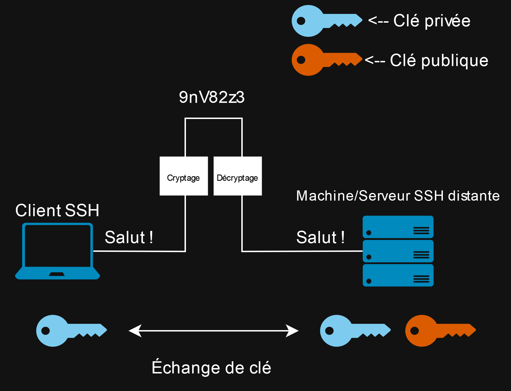
Exemple schématique du hachage :

## Première étape : Connexion SSH sur VM
Je vais partir du principe, pour cette documentation, que vous ayez déjà créer un SG (Security Group) et une machine virtuelle sur Azure.
Tout d'abord, vérifiez, que votre machine virtuelle est allumée. Pour vérifier qu'elle soit allumée, dans Azure, on peut se rendre dans la section "**Machines Virtuelles**", en faisant une recherche dans la barre de recherche présente en haut de la page :
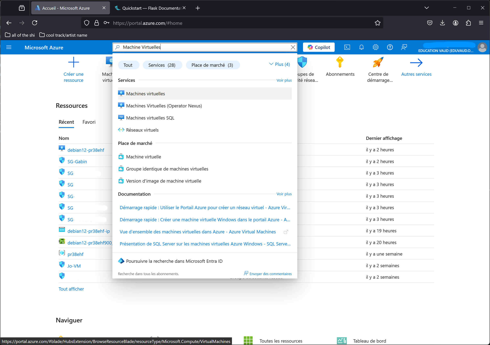
Vous devrez y apercevoir toutes les machines virtuelles de toutes les personnes qui ont le même abonnement que vous :
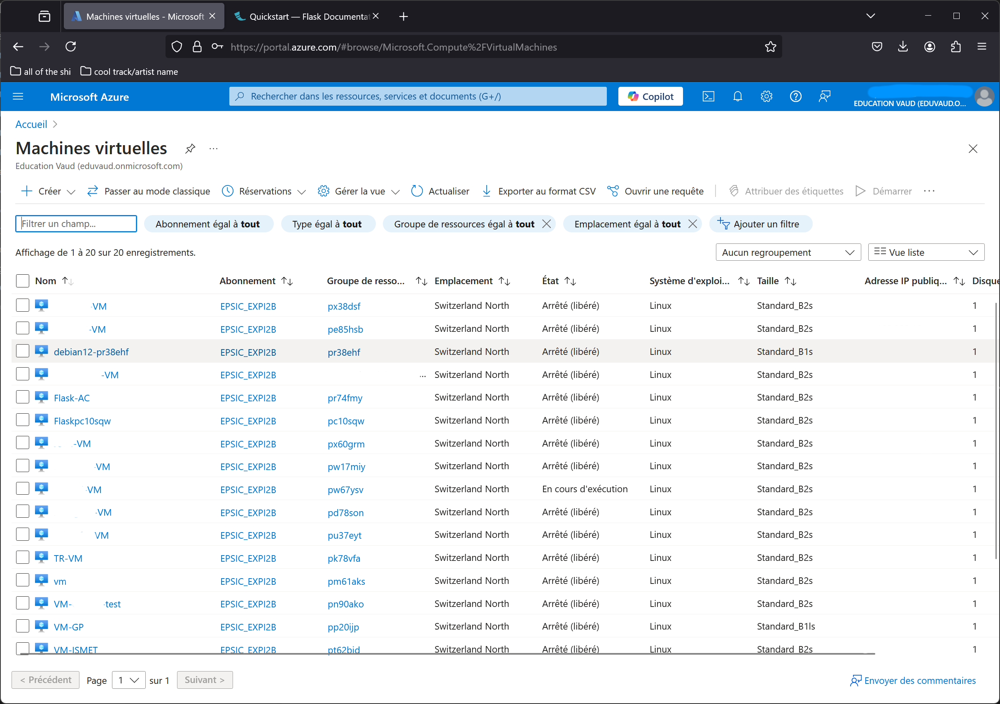
Vous devrez rechercher votre machine, dans la liste ci-dessus (dans mon cas, c'est la machine que j'ai nommée : "**debian12-pr38ehf**") et vérifier son état. Si elle est en "**Arrêter (libéré)**", il faudra l'activer, en cliquant sur son nom, puis sur "**Démarrer**" :
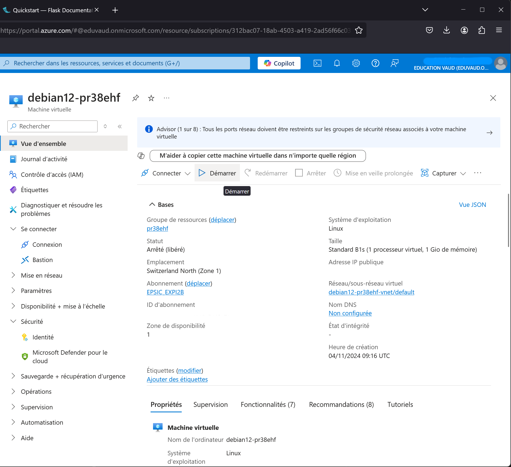
Par la suite, vérifiez que votre groupe de sécurité les règles de sécurité de trafic entrant accepte les connexions SSH depuis n'importe quel source, dans "**Groupe de sécurité**", puis dans votre groupe de sécurité (pour ma part, j'ai appelé le mien SG-Gabin) :
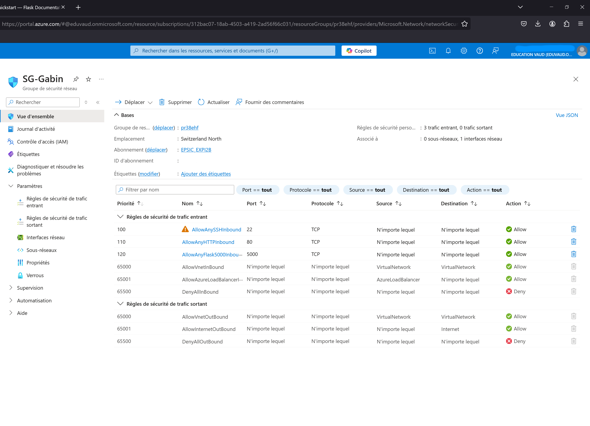
Ici, les connexions HTTP ne sont pas vraiment nécessaires, et je reviendrai plus tard sur le "**AllowAnyFlask5000Inbound**". Vous pouvez mettre les mêmes paramètres ci-dessous, comme moi, si le protocole n'est pas configuré :
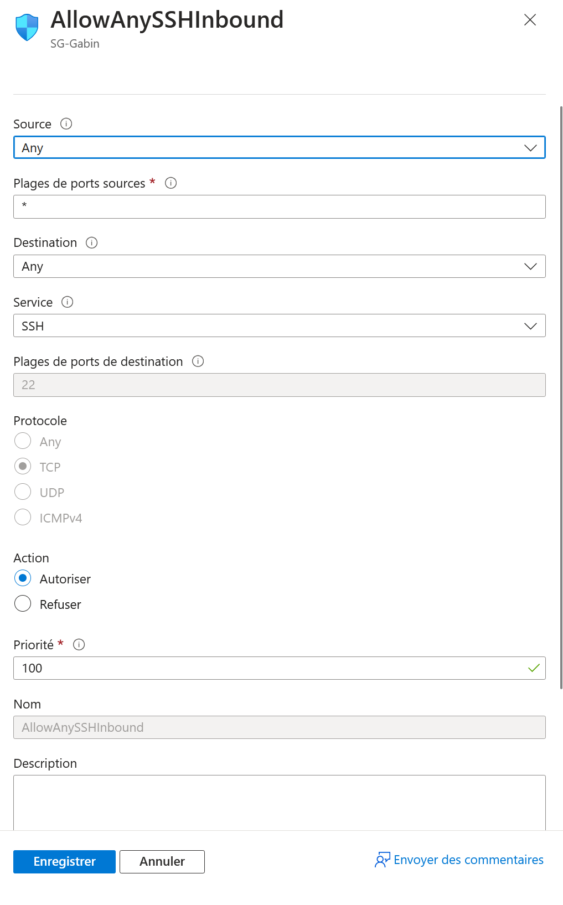
Il suffira juste de cliquer, en bas, sur "Enregistrer" pour que la règle soit créée.
Nous allons maintenant nous connecter sur notre VM en SSH ! Je vais utiliser Ubuntu 22.04.5 LTS sur Windows, en utilisant WSL2, pour cette documentation, la manipulation peut être différente si vous passez par PowerShell, par exemple. Et je me connecterais sur ma VM, qui est une VM Debian 12. Pour commencer, déplacez votre clé privée SSH, que normalement vous aurez téléchargé à la fin de la configuration de votre VM, dans votre dossier ~/.ssh/ sous Ubuntu. Pour éviter certaines erreurs, j'ai renommé ma clé en "**id_rsa.pem**".
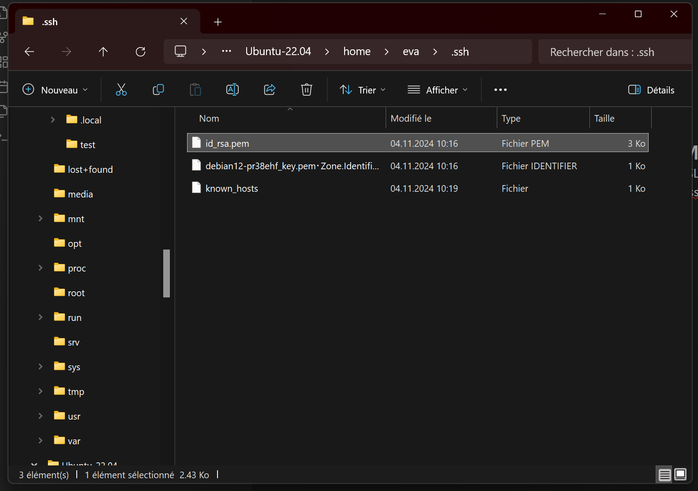
Ensuite, pour vous connecter sur votre VM, changez les accès sur votre clé privée en "READ ONLY". Pour exécuter cela, vous pouvez effectuer la commande suivante, dans votre terminal : 
```
chmod 400 ~/.ssh/le_nom_de_votre_clé
```
Après cela, connectez vous avec le compte que vous avez créer, et l'adresse IP publique de votre VM, en utilisant cette commande :
```
ssh -i ~/.ssh/le_nom_de_votre_clé votre_nom_de_user@l'adresse_ip.de.la.vm
```
L'adresse IP publique de votre VM peut se trouver dans ces spécifications, sur Azure.
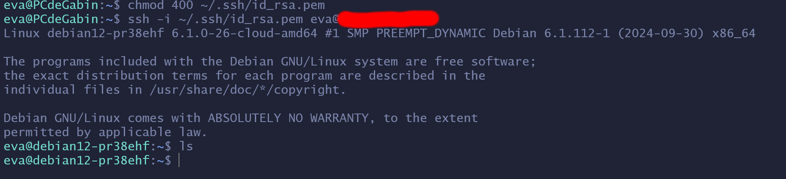
On peut d'ailleurs voir que mon terminal a changé le nom de l'utilisateur lorsque j'ai effectué la commande (c'est passé de "eva@PCdeGabin" à "eva@debian12-pr38ehf"), ce qui me confirme que je suis bien connecter à ma VM.
## Deuxième étape : Installation de Python & de la librairie Flask
Avant de pouvoir passer à l'installation, et à la configuration de la librairie Flask, vous devez mettre à jour vos paquets présents sur la machine pour pouvoir en installer des nouveaux, avec les deux commande suivante : 
```
sudo apt update
```
```
sudo apt upgrade
```
"**Sudo**" est nécessaire ici, car la commande qu'on veut effectuer a besoin d'une élévation.
Maintenant, nous allons pouvoir passer à l'installation de Flask. Tout d'abord, vérifiez si "Python" est installé, car nous allons l'utiliser pour la suite, en utilisant la commande, toujours dans votre terminal : 
```
python3 --version
```
Cela vous affichera la version de Python, et donc vous confirmera que Python est installé.
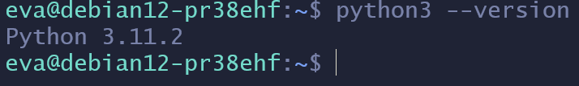
Puis, installez les paquets python qui sera obligatoire pour configurer Flask, avec la commande suivante :
```
sudo apt install python3-venv python3-pip
```
Voilà la liste des paquets qui vont être installée après qu'on ait effectué la commande ci-dessus :

Il suffira juste de taper sur "Y" pour que l'installation se commence.
Après l'installation, créez un dossier /labo/ avec :
```
mkdir labo
```
Ce dossier qui contiendra tous les fichiers. Puis rendez-vous dedans en utilisant la commande :
```
cd labo
```
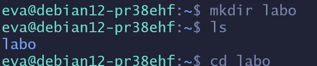
Ensuite, effectuez les commandes suivantes :
```
python -m venv .venv
```
D'abord "python3 -m venv .venv", qui va créer un sous-dossier /.venv/ dans mon dossier /labo/.
```
. .venv/bin/activate
```
Puis cette commande qui activera l'environnement que Flask a besoin. Petite remarque, si par hasard vous vous déconnectez de votre VM, il faudra refaire la commande ci-dessus pour réactiver l'environnement.
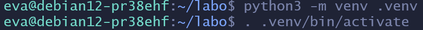
Pour finir, vous pouvez enfin installer la librairie Flask avec commande : 
```
pip install Flask
```
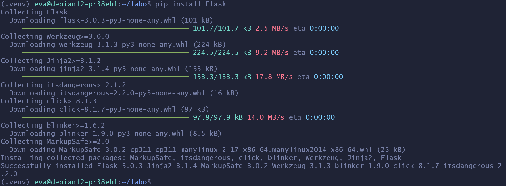
## Troisième étape : Création d'un projet Flask & configuration de l'instance 
Nous allons maintenant créer et configurer un petit projet Flask. Pour commencer, créez un fichier python qui nous servira pour créer notre page web avec la commande :
```
touch nom_du_fichier.py
```
Vous pouvez l'appeler comme vous voulez, sauf "flask.py" pour ne pas qu'il rentre en conflits avec Flask lui-même, mais j'ai décidé de l'appeler "hello.py". Et il ne faut surtout pas oublier de rajouter le "**.py**" à la fin pour que notre VM sait que le fichier est un fichier en python. 
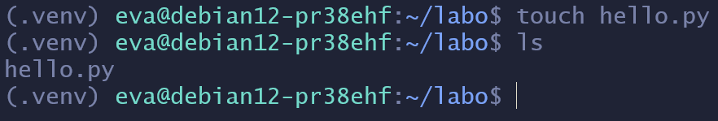
Ensuite, nous allons éditer ce fichier avec l'utilitaire Nano. Pour exécuter cela, utilisez la commande suivante : 
```
nano hello.py
```
Puis, dans votre fichier, nous allons configurer la page web, en utilisant le langage de programmation Python.
D'abord, écrivez au début de votre fichier cette ligne de code :
```
from flask import Flask
```
La ligne de code ci-dessus importe la classe "Flask", qui est nécessaire pour faire la page web. Par la suite, nous allons créer une instance de cette classe, avec ce code :
```
app = Flask(__name__)
```
La variable "app", contient le nom du module applicatif, dans notre cas "name", qui est un raccourci utile à utilisé de Flask. Cette ligne est nécessaire pour que l'application Flask sache où chercher ces ressources.
```
@app.route("/")
```
Ensuite, "route()" va dire à Flask quelle page (dans notre cas "/", s'il y en a plusieurs, il faudra mettre le nom de la page, par exemple : /test) doit lancer la fonction ci-dessous :
```
def hello_world():
	return "<h2>Hello, World!</h2>"
```
La fonction "hello_world()" va retournér le message qu'on a marqué dans la balise HTML de titre H2, celui-ci va être ensuite affiché dans le navigateur de l'utilisateur lorsqu'il accède à la page internet. 
Donc, le code de votre programme final devrait ressembler a ceci :
```
from flask import Flask

app = Flask(__name__)

@app.route("/")
def hello_world():
	return "<h2>Hello, World!</h2>"
```
Le programme est maintenant terminé !
Sauvegardez le fichier, puis quittez Nano (normalement CTRL+X).
Nous allons maintenant "host" notre page web en utilisant Flask. Pour le faire, il suffit juste d'exécuter cette commande, dans votre terminal :
```
flask --app nom_du_fichier.py run --host=0.0.0.0
```
Le --host=0.0.0.0 est nécessaire, dans notre cas, car cela va permettre d'avoir accès sur notre page web depuis n'importe quelle machine, en utilisant l'adresse IP publique de notre VM.
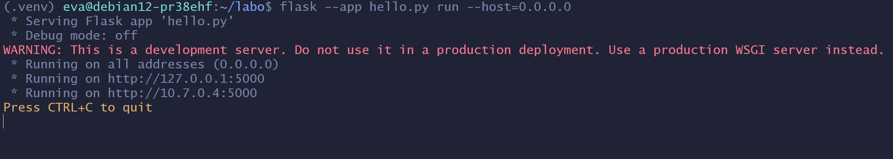
Pour arrêter que Flask tourne, vous pouvez faire la combinaison de touche "CTRL+C".
Vous pouvez d'ailleurs apercevoir que l'application Flask à host notre page web sur le port 5000. Cela m'amène à mon dernier point de cette étape. Pour pouvoir nous connecter à l'application web, il faut ajouter la dernière règle du trafic entrante, dans votre groupe de sécurité, qui accepte n'importe quelle connexion sur le port 5000 (le port que Flask écoute). Donc voici la configuration qui faut faire :
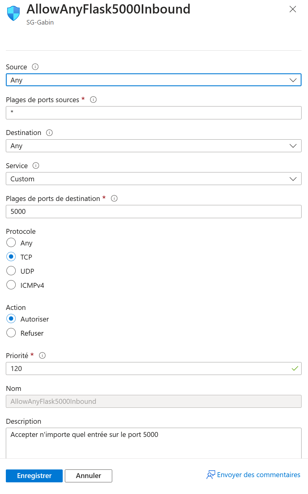
Cliquez, pour finir, sur "**Enregistrer**".
## Quatrième étape : Se connecter à l'application web
Pour pouvoir se connecter sur l'application web, il faudra entrer, dans votre navigateur de préférence, l'adresse IP publique ainsi que le port 5000.
Et normalement, vous devrez arriver sur votre page web :
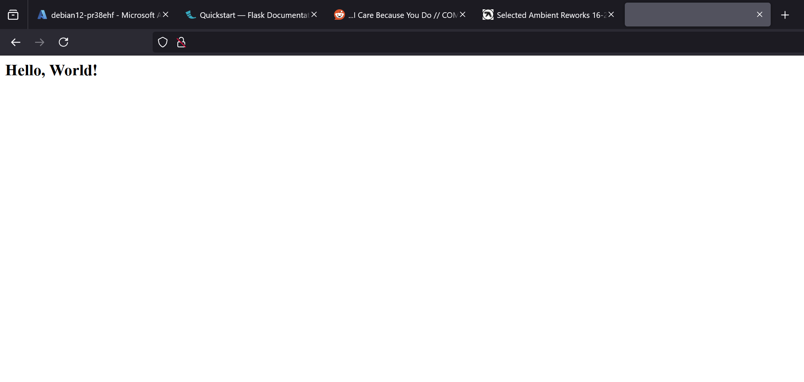
Vous pourrez aussi voir, si vous retournez sur votre terminal, toutes les connexions qui se font sur votre page web :
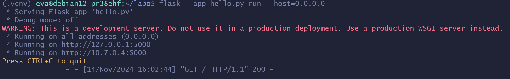