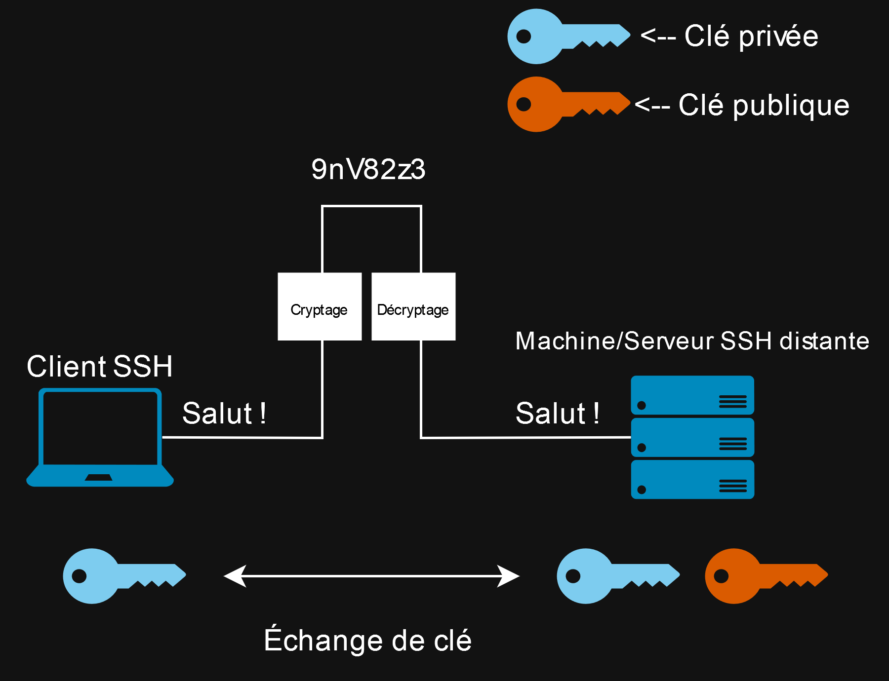
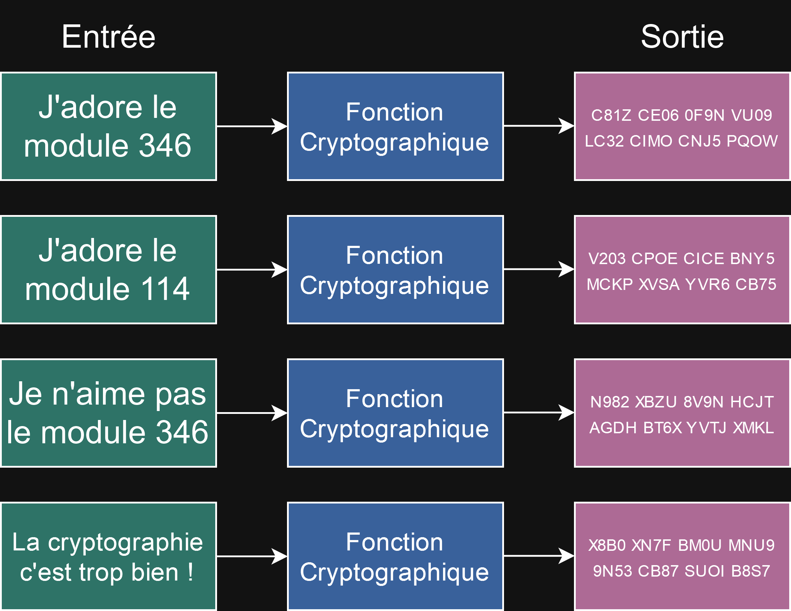
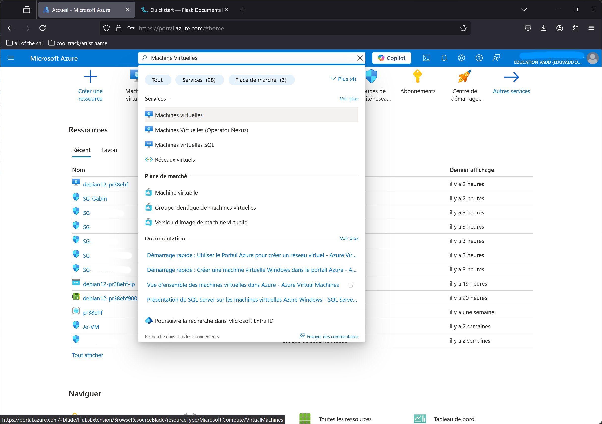
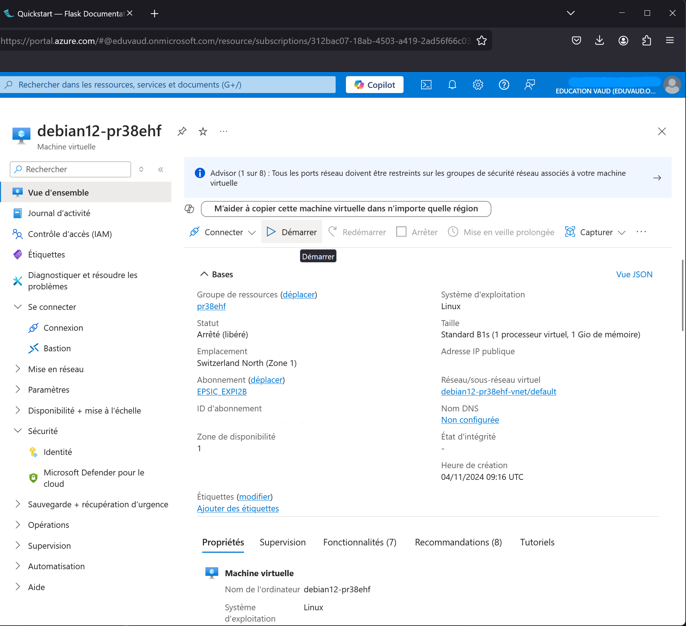
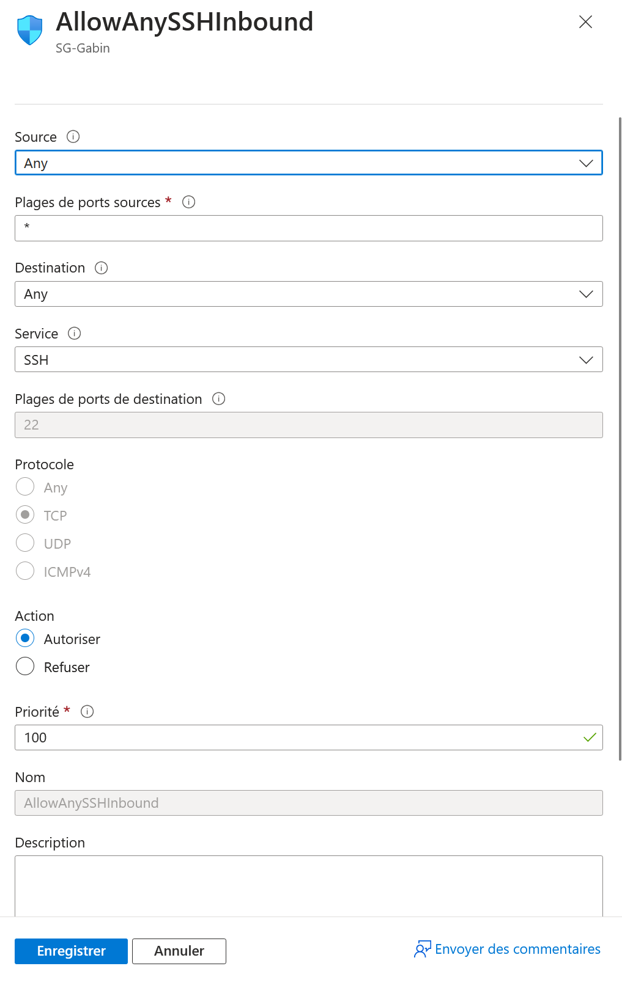
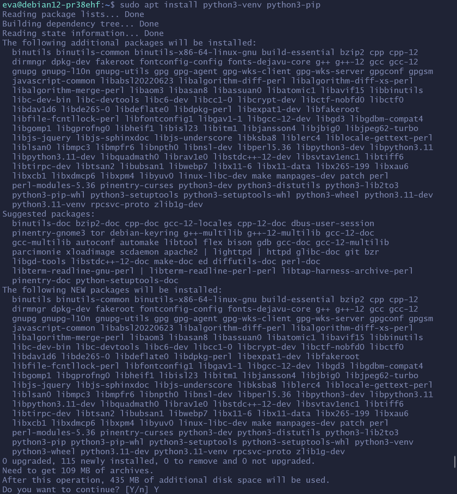
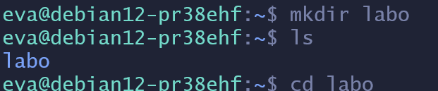
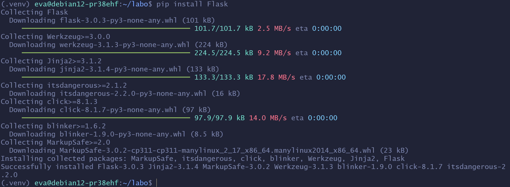

We're going to create a small website, using the library by Pallets called : Flask.
## Goals:
Create a small web application, using Flask, on a virtual machine running on Azure. To create this application, you will only use the command line to connect on the virtual machine using SSH.
## What's SSH ?
Secure Shell (SSH for short) is a network protocol for securely sending commands on a machine. It's using the port 22 of TCP, under the transport layer of the OSI model. 
It's mainly used to connect on a distant machine, using cryptographic keys. By the way, when the protocol is used, there's two key :
- The public key :
	- Saved on the distant machine, public for every users.
- And the private key :
	- Saved on our machine, only accesible by us.

And for authentication, there's multiple cryptographic types :
- Symmetric encryption
	- It's a form of encryption in which a secret key is used for both encryption and decryption.	
- Asymmetrical encryption :
	- Here, two separate keys (public and private) are used for encryption and decryption. This is the type of encryption that will be used to connect to the virutal machine on Azure.
- Hashing:
	- This is the act of transforming a character string into a value or key of fixed length, generally shorter than the original string.

Example of a SSH connection :


Example of Hasing :


## First step : SSH connection on a virtual machine
For the purposes of this documentation, I'm going to assume that you've already created an SG (Security Group) and a virtual machine on Azure.

Firstly, check if your virtual machine is powered. In Azure, you can do that by going into the "**Virtuals Machines**" section, by searching in the research field on top of the page :


You'll see every virtuals machines within the same Azure subscription as yours :


You'll need to research your virtual machine in the list (in my case, it's the machine called : "**debian12-pr38ehf**") and you'll need to check its state. If it's stopped, you'll need to start it, by clicking on its name, then on "**Start**" : 


After that, check if your network security group has a inbound trafic rule which accept SSH connection from any sources, in "**Security Group**", then choose your group (for me, I've called mine : "**SG-Gabin**") :


Here, the HTTP connections aren't really necessary, and I'll come back later on the "**AllowAnyFlask5000Inbound**". You can chose the same parameters as me, if you haven't configured it :


Finally, you'll need to click on "**Save**", down the page, to create this inbound rule.
 
Now, we're ready to connect to our virtual machine using SSH ! I'm going to use Ubuntu 22.04.5 LTS on Windows, using WSL2, for this documentation. The handling may be different if you use PowerShell, for example. And I'll connect to my virtual machine, which is a Debian 12 virtual machine. 

Firstly, move your private SSH key, which normally you've download it at the end of the configuration of your virtual machine, in the folder "~/.ssh/" on Ubuntu. To reduce errors, I've renamed my key : "**id_rsa.pem**".


[//]: <> (To rewrite)
If the "~/.ssh/" folder isn't there, or if you have the error below, while trying to accessing the folder through your terminal :

[//]: <> (Add the right error here, now it's incomplete/wrong...)
```
"... no such file or directory" 
```

[//]: <> (To rewrite)
You can try to use a SSH command. For example, you can try to connect to your virtual machine with this command :
```
ssh your_username@ip_virtual_machine
```
Normally, this command will create the folder, which you can move and rename the key.
Then, change the key permissions to "READ ONLY". To do this, you can use this command in your terminal : 
```
chmod 400 ~/.ssh/name_of_your_key
```
After that, connect, to the virutal machine, using the account you've created and the public IP address of your virtual machine, with this command :
```
ssh -i ~/.ssh/name_of_your_key your_username@ip_virtual_machine
```
The public IP address of your virutal machine can be found in its specification, on Azure.


You can also see that the username has changed in your terminal (in my case, it went from "eva@PCdeGabin" to "eva@debian12-pr38ehf"), which confirms that we've successfully connected to the virtual machine.
## Second step : Python & Flask installation
Before installing Python and Flask, you'll need to update your current paquets on the virtual machine before installing new ones, with these commands :
```
sudo apt update
```
```
sudo apt upgrade
```
"**Sudo**" here is necessary because these commands needs an elevation to be executed (they cannot be executed with a normal account).

Now, we can install Flask. Firstly, check if Python is installed, because we're going to use it after, with this command (still in the terminal) :
```
python3 --version
```
This will show you the version of Python, and will confirms that Python is installed on the machine.


If it's not installed, use this command instead :
```
sudo apt install python3
```
Then, installed the packages "venv" and "pip", which will be necessary to configure Flask, with this command :
```
sudo apt install python3-venv python3-pip
```
Here's the list of all the packages that will be installed on your virtual machine after you've entered the command above :


To start the installation, enter "Y" in the command line.
After the installation is finished, we can start configuring Flask, by firstly creating a folder "/labo/" (or any name that you'll like) with this command
```
mkdir labo
```
This folder will contain all the file of our web application. Next, go inside the folder with this command :
```
cd labo
```


After entering the folder, write these commands in the command line :
```
python -m venv .venv
```
Firstly, "python3 -m venv .venv", which will create a sub-folder /.venv/ in your folder.
```
. .venv/bin/activate
```
Then this command will activate the environment Flask requires. 
Note that if you disconnect from your virtual machine, you'll need to run the above command again to reactivate the environment.

 
Finally, install the Flask library with this command :
```
pip install Flask
```


## Third step : Creation & configuration of the web application
Now, we're going to create and configure a small Flask project. To get started, create a Python file inside your folder, which will be used to create our web application :
```
touch name_of_your_file.py
```
You can name whatever you like except "flask.py" so that it doesn't conflict with Flask. I've decided to name mine : "hello.py". And don't forget the "**.py**" at the end so that the virtual machine knows that's a Python file.


Then, edit the file with a tool like Nano or Vim. I'll use Nano for this documentation.
```
nano hello.py
```
Inside your file, we'll configure the web application using the programming language : Python.
Firstly, write at the start of your file this line of code :
```
from flask import Flask
```
This will import the class "Flask", necessary to make the web application. 
After that, create an instance of this class with this code :
```
app = Flask(__name__)
```
The variable "app" contain the name of the module, in this case "__name__" (which is a shortcut used in Flask). This line is necessary because it tells Flask where to find his ressources.
```
@app.route("/")
```
Next, "route()" will again tell Flask which page needs to start the function bellow (in our case "/", if you have multiple page, you'll need to specify the name of the page, for exemple : /test) :
```
def hello_world():
	return "<h2>Hello, World!</h2>"
```
The fonction "hello_world()" will return the message you've writtent inside the HTML tag H2, which is then displayed in the user's browser when they access the web page. 
So, the final of your program should look like this :
```
from flask import Flask

app = Flask(__name__)

@app.route("/")
def hello_world():
	return "<h2>Hello, World!</h2>"
```
The program is now finished !
Sauvegardez le fichier, puis quittez Nano.
Save your Python file, and quit your text editor (normally CTRL+X in Nano).
We'll now "host" our web application using Flask. To do that, write this command in your terminal :
```
flask --app name_of_your_file.py run --host=0.0.0.0
```
The "--host=0.0.0.0" here is necessary because it'll make your page accessible from any computer (whether you're inside or outside his network) using the public IP adresse of your virtual machine.


To stop Flask, use "CTRL+C".
As you can see, the Flask application is hosting our web page on port 5000. This brings me to my last point in this step. To be able to connect to the web application from any computer, we need to add the last incoming traffic rule, in your security group, which accepts any connection on port 5000 (the port Flask listens to). So here's the configuration we need to add, in our SG, to make this works :


Finally, click on "**Save**".
## Final step : Connection to the web application
To connect to the web application, you'll need to enter the public IP address and port 5000, preferably in your browser.
And you should arrive on your web page:


If you return to your terminal, you will also be able to see all the connections made to your web page:

