In this project, we're going to install the CMS (Content Management System) Drupal, to create and manage a website. After that, we'll test its ability to scale up, with the JMeter application.

## Goals
- Install a CMS (in our case Drupal), on a virtual machine in the Azure Cloud.
- Install JMeter to test the ability to scale up of the website.
## What's scalability ? 
Scalability is the ability of a system (in our case, a website) to adapt to increasing or decreasing demand without losing performance. In a scalable system, when the request becomes higher, the system can manage this increase without crashing. On the other hand, when the requests becomes smaller, the system can also adapt itself without losing its performances. Topday, almost every websites, and applications, uses a scalable system (e.g. : Amazon, AliExpress, Facebook, Instagram, Netflix, Google, etc... have all an infrastructure which allows them to adapt to the multiple requests and ensure a good experience for the users)

## Preface
To make the project work, we're going to install a few programs. Here's a list of the programs we're installing on our virtual machine :
- [Apache2](https://httpd.apache.org/) (web server)
- [PHP 8.3](https://www.php.net/) (language for the web pages)
- [MariaDB](https://mariadb.org/) (DBMS to create the DB for Drupal)
- [Composer](https://getcomposer.org/) (dependency manager for PHP)
- Et [Drupal](https://new.drupal.org/home) (the CMS we're going to use in this project)

And here's another list of programs we're installing on our local machine :
- [Java 23](https://www.oracle.com/ch-fr/java/technologies/downloads/) (language to make JMeter work)
- [JMeter](https://jmeter.apache.org/) (program to test the scalability of our website)
## First step, CMS installation
Before we get started with the installation of the programs, we firstly need to update the package on our virtual machine, with these commands :

```
sudo apt update
```

```
sudo apt upgrade
```

Here, "sudo" is necessary because the action we want to make cannot be done with a normal user. 
### 1) Apache2 Installation
Apache2 is a free HTTP server maintained by the Apache Foundation, and is distributed within the Apache licences. It's one of the most popular HTTP server. We're going to install and configure it for this project.
To install the server, you can write this command in your terminal : 

```
sudo apt install apache2
```

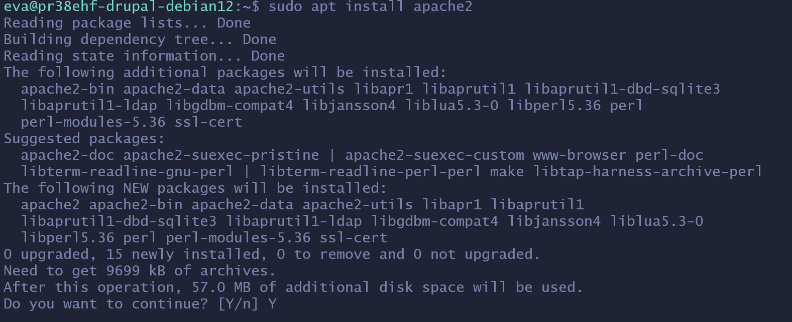
You'll need to enter "Y" when the terminal prompt you if you want to install the packages. Once every packages installed, you can start up the service of the server with this command : 

```
sudo systemctl enable apache2 && sudo systemctl start apache2
```

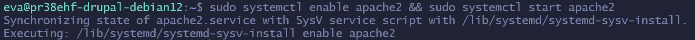

Here, I've written "&&", this makes it so that we can enter two commands once.
To verify if the service is up and running, you can write this command :

```
sudo systemctl status apache2
```

Normally, you'll see this in your terminal :


If you want to quit, you can just press on "Q".
### 2) PHP 8.3 Installation
After installing Apache2, we're going to install PHP 8.3.
PHP : Hypertext Preprocessor, mostly known by the name PHP, is a free scripting language, mostly used to create dynamic web pages.
Before we start, we'll install some dependecy, first "apt-transport-https" with this command :

```
sudo apt install apt-transport-https
```


Then, we're going to add a repository that will let us have the latest PHP modules, and the key to access it.
First the repository :

```
sudo curl -sSLo /usr/share/keyrings/deb.sury.org-php.gpp https://packages.sury.org/php/apt.gpg
```


Then the key :

```
sudo sh -c 'echo "deb [signed-by=/usr/share/keyrings/deb.sury.org-php.gpg] https://packages.sury.org/php/ $(lsb_release -sc) main" > /etc/apt/sources.list.d/php.list'
```


After that, we can retype the "sudo apt update" command to have the PHP packages up to date.


Thereafter updating the package, we can add multiple PHP module that are going to be usefull and necessary for this project, using this command :

```
sudo apt install php8.3-{cli,common,imap,redis,snmp,xml,mysql,zip,mbstring,curl,gd}
```


As I said before, to start the installation, press "Y".
We can see that we're installing modules such as : cli, imap, xml, mysql, etc...

I've also added one last module for PHP and our Apache server, with the command line : 

```
sudo apt install php8.3 libapache2-mod-php8.3
```


To check if it's installed, you can use this command :

```
php -v
```


And to check if the modules of PHP are installed, this time, you can use this command :

```
php -m
```


### 3) MariaDB Installation

MariaDB is a database management system (DBMS) licensed under GPL. It's a community "fork" of MySQL, another DBMS. We're going to use it to create databases for Drupal.

First, write this command to install it :

```
sudo apt install mariadb-server
```


Then, to activate and start this DBMS, use this command :

```
sudo systemctl start mariadb && sudo systemctl enable mariadb
```

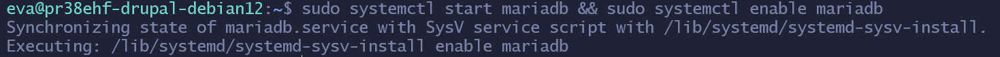

Finally, to check its status, you can use this command below :

```
sudo systemctl status mariadb
```

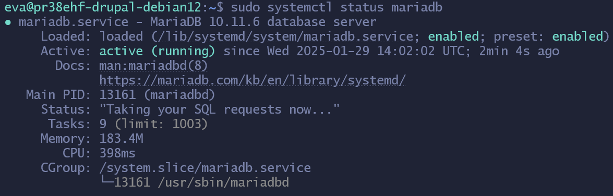

### 3.1) DB Configuration for Drupal

Before installing the last two programs (Composer and Drupal), we're going to configure a database, for Drupal, using MariaDB.

To connect to the DBMS, you can use this command :

```
sudo mysql -u root
```


For starters, we're going to create a user with enough permission to access and manipulate the datas ot the database. This step is necessary, because these informations will be required during the configuration of Drupal.

To create a user, here's the command you'll need to enter in your DBMS :  

```
CREATE USER 'drupal'@'localhost' IDENTIFIED BY 'votre_pwd_ici';
```


The username here doesn't really have importance. But, something you shouldn't forget is the "localhost" after the username.

"IDENTIFIED" is used to configure a password for the user. It is not necessary unless you want to add another layer of security to your databases.

Then, create the database using this command :

```
CREATE DATABASE drupal; 
```


Again, the name that you choose, for your databases, doesn't really have importance, you can name it whatever you like. I choosed "drupal" so that for better understanding.

After that, you can add the permissions to the user, that we created before, on the database : 

```
GRANT ALL PRIVILEGES ON drupal.* TO 'drupal'@'localhost';
```

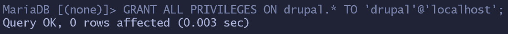

For simplicity, I gave all the permissions on all the tables of the database named "drupal".

Finally, to applied the permission on the DMBS, use this command below : 

```
FLUSH PRIVILEGES
```

And, since we're not going to use the DBMS for now, you can disconnect from it :

```
EXIT;
```


### 4) Composer Installation

There's multiple ways of installing, and configuring, Drupal. For this documentation, I'll use the application : Composer.

Composer is a free dependency manager designed for the PHP language. With it, we can download libraries that our project need.

To install Composer, we're going to download his installer, using this command : 

```
wget -O composer-setup.php https://getcomposer.org/installer
```

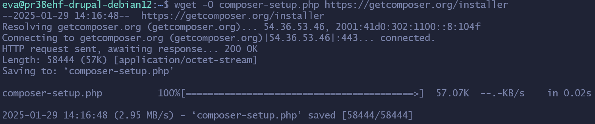

Then, you can launch it, after the installation is over : 

```
sudo php composer-setup.php  --install-dir=/usr/local/bin --filename=composer
```

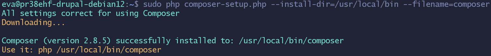

We can use this command below to check if the application is correctly installed :

```
composer -v
```

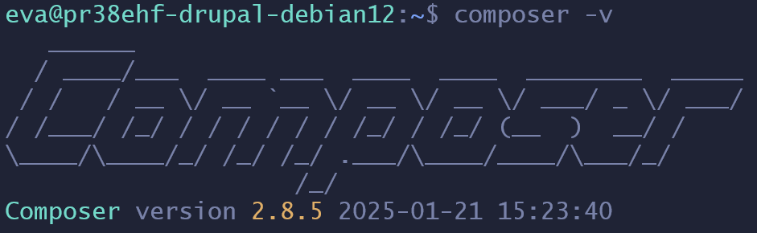

### 5) Drupal Installation

We can finally install Drupal !

Drupal is a free and open-source content management system (or CMS) licened under the GNU General Public License. Like Composer, it's a program written in PHP. We're going to use it to create a website for this project.

Firstly, install the Drupal template using this command :

```
sudo composer create-project drupal/recommended-project my-drupal-project
```

This will download every files that we're going to need, and this will avoid doing even more steps. 

Next, you'll need to create a configuration file, on the Apache server, to acces Drupal on a browser. The next steps for the installation and the configuration of the CMS will be indicated in the browser.

First of all, to create the configuration file, go in the site available directory of the web server using this command :

```
cd /etc/apache2/sites-available/
```

Then, to actually create the file, use this command :

```
sudo touch drupal.conf
```

Here, "sudo" is necessary because you don't have the rights to modify in the "/etc/apache2/sites-available". The name doesn't really have importance.

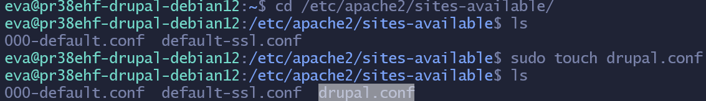

To modify this file, I'm going to use the text editor called "Nano" :

```
sudo nano drupal.conf
```

As said before, you don't have rights to modify, that's why we need to add "sudo" infront of the command.

Foremost, write these two ligns in your file :

```
<VirtualHost *:80>
ServerName localhost
```

This lign, is a tag that tells the Apache server that every connection on the port 80 (HTTP) will get redirected to itself. If you have a domain name, you can replace the localhost with this name. In my case, I don't have a domain, so I'll keep localhost.

Then, you need to precise, in the configuration file, the path to Drupal's ressources, so that the Apache server knows what to show when we'll arrive on the site. In my case, the command lign is this :

```
DocumentRoot /home/eva/my-drupal-project/web
```

The next step consist of defining the parameters of the path to the ressources :

```
<Directory /home/eva/my-drupal-project/web>
AllowOverride All
Require all granted
</Directory>
```

The last lines that will be written in the file concerns the logs. They're not necessary, but useful for debugging, I'll still write it in my configuration file :

```
ErrorLog ${APACHE_LOG_DIR}/error.log
CustomLog ${APACHE_LOG_DIR}/access.log combined
```
And to finish, we're going to close the tag that we've open at the beginning, using this command :

```
</VirtualHost>
```
So, your configuration file should look like this :

```
<VirtualHost *:80>
	ServerName localhost

	DocumentRoot /home/eva/my-drupal-project/web

	<Directory /home/eva/my-drupal-project/web>
		AllowOverride All
		Require all granted
	</Directory>

	ErrorLog ${APACHE_LOG_DIR}/error.log
	CustomLog ${APACHE_LOG_DIR}/access.log
</VirtualHost>
```
Do the key combination "CTRL+S" to save the file, and "CTRL+X" to exit Nano, if you edited the file with this text editor.

Then, you'll need to replace the orignal Apache2 configuration file with the one file we've just made, first by deactivate it with this command :

```
a2dissite 000-default.conf
```

Then, by activate the other configuration file using this command below :

```
sudo a2ensite drupal.conf
```

Finally, restart Apache2 : 

```
systemctl restart apache2
```

### 5.1) Drupal Installation, follow-up

Once the file is configured, you can open a browser of preference, and enter the public IP address of your virtual machine, with the HTTP port (so the port 80), just like this :

```
public.ip.address.vm:80
```

You should normally end up on the "Choose Language" section of Drupal.

If you end up on a Apache2 page (example bellow), try to enter the last commands of the 5th chapter.

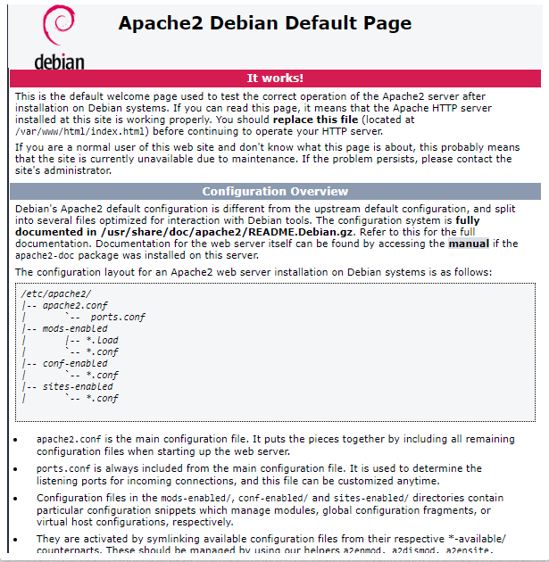

In the first section, you can choose the language of Drupal. For simplicity reasons, I've decided to use English as a language. Then, click on "Save and continue".

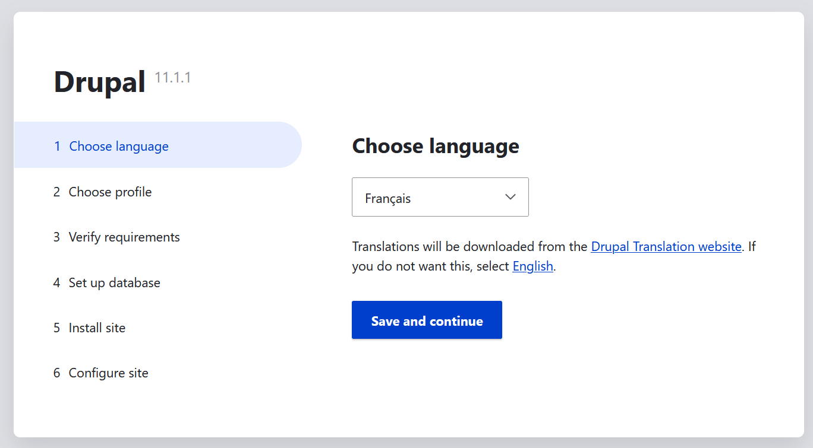

Then, in the next section "Choose profile", you can choose between these tree types of installations :

- Standard :
	- Standard installation of Drupal, with pre-built configuration. This is the one that we're going to use to create our website.
- Minimal :
	- Minimal installation, without any pre-built configuration. For advanced users.
- Demo: Umami Food Magazine (Experimental) :
	- Example site to show the capacity of Drupal.

Choose the stardard installation and click again on "Save and continue".


It's possible that the installation returns errors about files not found, or permissions problems. But don't worry, I also got these kind of problems during my install. So here's some command that could solve those error !

Création du dossier "sites/default/files" :

```
sudo mkdir sites/default/files
```

Modification des droits d'accès sur celui-ci :

```
sudo chmod a+w sites/default/files
```

Renommage du fichier "default.settings.php" en "setting.php" dans le dossier "sites/default" :

```
cp sites/default/default.settings.php sites/default/settings.php
```

Modification des droits d'accès sur le fichier :

```
chmod a+w sites/default/settings.php
```

After entering these commands, reload the page of the Drupal installation, and normally, you should end up on the "Set up database" section.

Here, enter the informations of chapter four, for the configuration of the databases for Drupal. Then, click on "Save and continue".

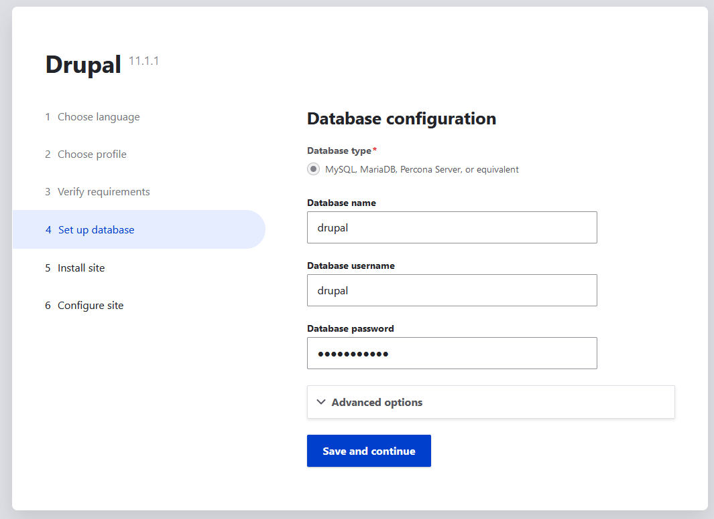

Finally, Drupal will install. This can take some minutes. 

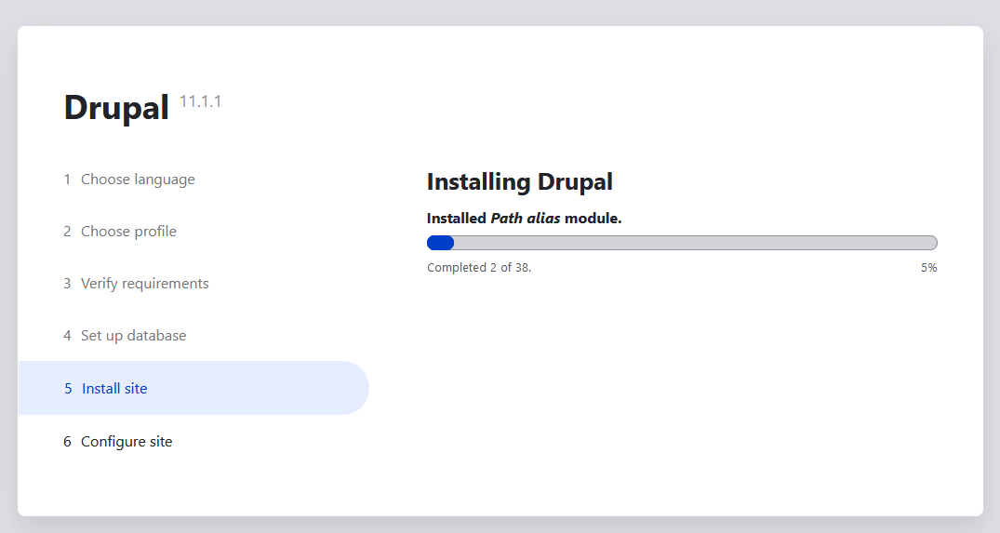

In the last section "Configure site", enter informations like the name of the site, the maintenace account, etc...


Normally, the site with load, and you'll arrived on the welcome page.

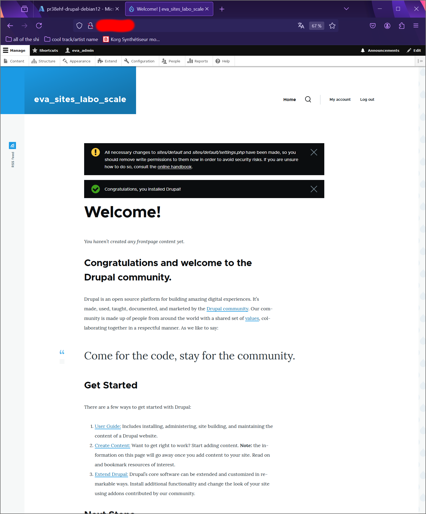

### 6) Création d'un article

Avant de passer au test de performance, nous allons créer un article sur notre site. 
Pour commencer, cliquer sur le bouton "Content" en haut à gauche de votre site, normalement en dessous de "Manage". 
Une nouvelle page s'ouvrira, où vous pourrez cliquer ensuite sur le bouton "+ Add content".

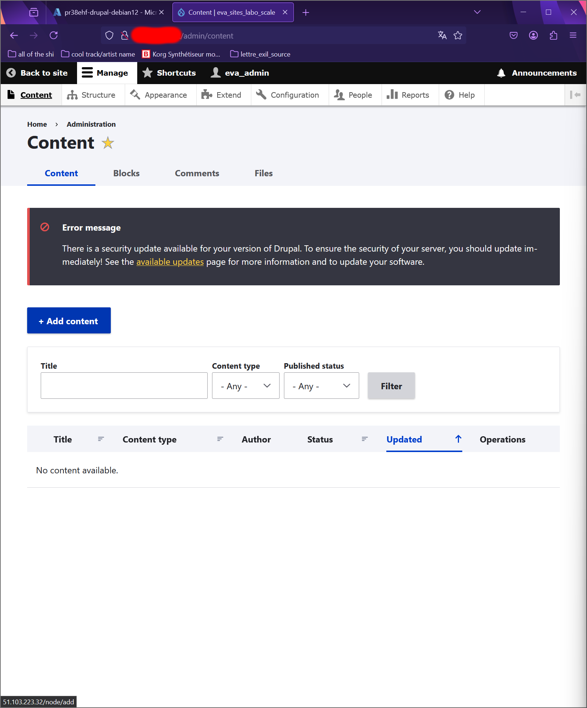

Puis, cliquez sur "Article".


Ensuite, une nouvelle page s'affichera. C'est ici où nous allons pouvoir éditer notre article. Il y a plusieurs éléments à prendre en compte :
- "Title", le titre de l'article.
- "Image", une image qui commencera l'article. Cela n'a pas d'importance.
- "Alternative text", dans la section "Image", une petite description qui s'affichera lorsque l'image n'arrive pas à se charger.
- "Body", le contenu de l'article. Cela peut être du texte, des tableaux, des images, etc...
- "Tags", balises permettant de séparer des articles entre eux. Encore une fois, cela a très peu d'importance.
- Et finalement "URL alias", le chemin de l'article qui est à précisé. Attention, vous n'avez pas besoin de préciser l'adresse de votre site, juste le sous-chapitre où vous aimerez que l'article y soit.

Une fois vos modifications terminées, vous pourrez simplement cliquer sur le bouton "Save", qui se trouve normalement en bas à gauche de votre page.

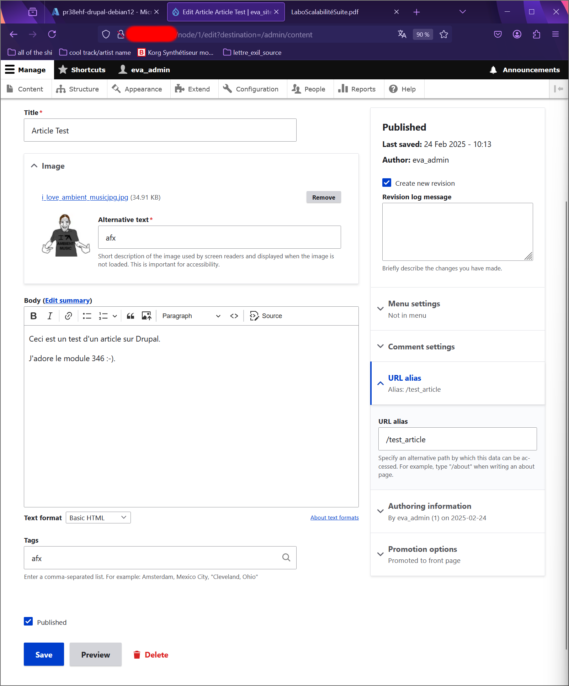

L'article s'ouvrira, où vous pourrez voir si vos modifications ont été faites.


## Deuxième étape, installation JMeter

JMeter est un logiciel libre, écrit en Java, permettant d'effectuer des tests de performance d'applications ou de serveurs selon les protocoles. Il est développé par la Fondation Apache. 

Nous allons l'utiliser pour mesurer le temps de réponse de chaque requête HTTP sur notre site web.

### 1) Installation de Java 23

Java est un langage de programmation de haut niveau orienté objet. Nous allons installer la version 23 (dernière version officiellement disponible depuis le 17 septembre 2024) pour pouvoir utiliser JMeter.

Tout d'abord, rendez-vous sur le site d'Oracle pour pouvoir télécharger Java 23. Autrement, vous pouvez suivre le lien [ici](https://www.oracle.com/ch-de/java/technologies/downloads/#jdk23-windows).

Choisissiez l'OS installé sur votre machine locale. Dans mon cas, ma machine est sous Windows 11, donc je vais dans la section Windows. Cela vous montrera différentes manières d'installer la version 23 de Java, personnellement, je vais utiliser l'installation en MSI (Microsoft System Installer) pour cette documentation.

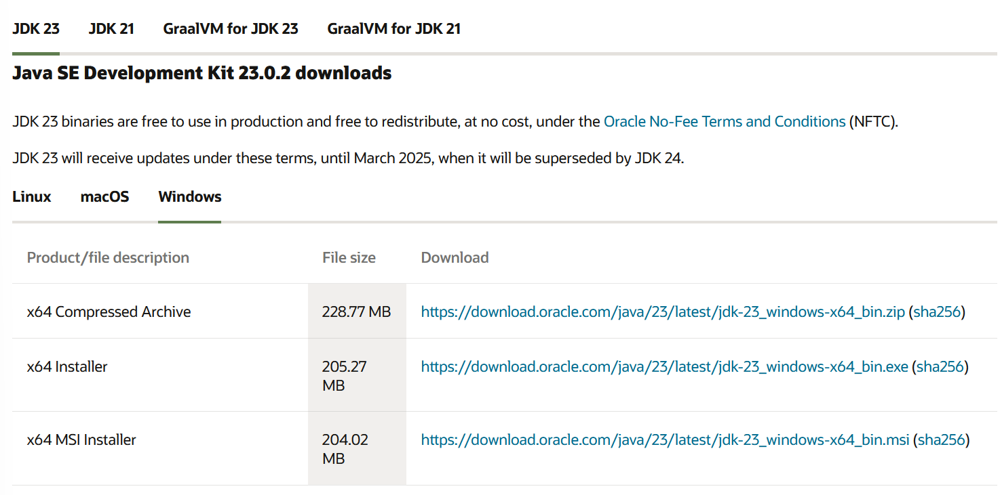

Une fois télécharger, ouvrez le fichier.

Cliquez ensuite sur "Next >", quand la fenêtre s'ouvrira.


Ici, vous pouvez changer le dossier de destination de Java 23 (pour ma part, je vais le laisser par défaut). Cliquez ensuite sur "Next".

Puis, le téléchargement commencera. Cela peut prendre quelques minutes.

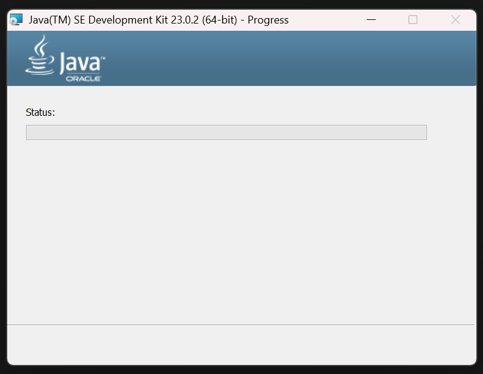

Une fois le téléchargement fini, vous pouvez cliquer le bouton "Close".


Normalement, si l'installation de Java 23 s'est bien passé, vous pouvez ouvrir un CMD et entrez la commande suivante :

```
java -version
```


Si vous obtenez ce résultat (comme dans la capture d'écran) cela indique que le programme s'est bien installé !

### 2) Installation de JMeter

Nous allons désormais installer JMeter. Pour l'installer, vous pouvez suivre le lien suivant : [ici](https://jmeter.apache.org/download_jmeter.cgi).

Ensuite, choisissiez le dossier compressé à télécharger selon votre système d'exploitation (préférablement ".tgz" pour Linux et ".zip" pour Windows).


Et décompressez le dossier.

Recherchez, dans votre dossier décompressé, le fichier de commande Windows "jmeter.bat" (par exemple, le chemin d'accès de mon fichier "jmeter.bat" est le suivant : C:\Users\gabin\Documents\apache-jmeter-5.6.3\apache-jmeter-5.6.3\bin) et lancez le fichier, pour lancer JMeter. 


Normalement, après avoir ouvert le fichier, vous devrez arriver dans JMeter :

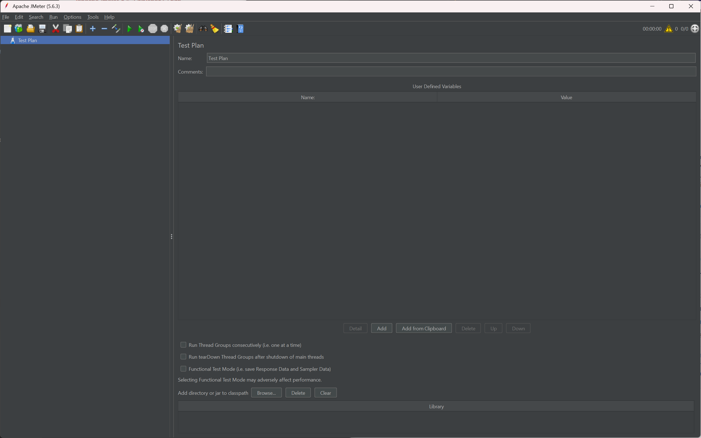

### 3) Configuration de JMeter

Avant de pouvoir effectuer des tests sur notre site web Drupal, nous devons configurer JMeter.

D'abord, commencer par sauvegarder votre test. Vous pourrez aussi choisir l'emplacement du fichier de test.

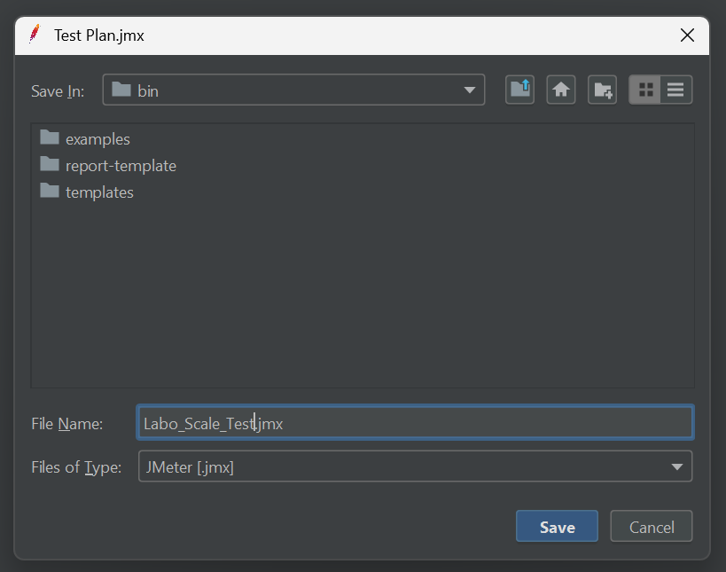

Ensuite, dans la section "Test Plan", pour faire les choses proprement, vous pouvez renommer votre test. Dans mon cas, je l'ai nommé comme mon fichier de test.


Puis ajouter un "Thread Group" dans votre test, en allant dans "Edit", "Add", "Threads (Users)", et finalement "Thread Group".


Un "Thread", dans JMeter, est un utilisateur virtuel qui exécute votre test en envoyant de multiples requêtes HTTP à votre serveur web, pour tester la performance de votre site web. Donc, finalement, le "Thread Group" est, mot pour mot, un groupe d'utilisateurs prêts a effectué des requêtes.

Après avoir créé le "Thread Group", celui-ci ouvrira une nouvelle fenêtre. C'est ici où nous allons pouvoir configurer les différents paramètres de notre test.


Il y a certains paramètres à prendre en compte. 

Le "Number of Threads (users)" est le nombre d'utilisateurs virtuels qui vont effectuer une requête. Plus ce nombre est grand, plus il y aura de requêtes. 

Le "Ramp Up", dans le "Thread Group", va être le temps, en seconde, que JMeter doit prendre pour démarrer le nombre total de threads. Entre autres, si notre test comprend cent "Threads" avec un "Ramp-up" de cent secondes, cela signifie que JMeter va démarrer un utilisateur virtuel toutes les secondes. Donc, au bout de cent secondes, tous les utilisateurs seront en train d'envoyer des requêtes HTTP, sur votre serveur web. 

Le "Loop count" va être le nombre d'exécutions des multiples requêtes HTTP des utilisateurs virtuels (littéralement, combien de fois le programme va effectuer X nombre de requêtes). Par exemple, si ce nombre est fixé à deux et le nombre de threads est à cent, alors il y aura deux cents requêtes sur votre site web. Si par contre, vous cocher la case "Infinite", les requêtes continueront jusqu'à ce que le test soit arrêté. 

Je vous indiquerai plus tard, dans la documentation, les valeurs des paramètres que vous pourrez inscrire dans le "Thread Group".

Ensuite, ajoutez dans le "Thread Group", un sampler d'une requête HTTP, en allant dans "Edit", "Add", "Sampler", puis "HTTP Request" pour pouvoir précisé les informations de votre site (par exemple : l'IP de celui-ci, ou encore le lien sur l'article précis).


Par exemple, voici à quoi ressemble mon sampler HTTP :


Quand vous aurez fini de préciser les paramètres du sampler HTTP, vous pourrez finalement cliquer sur le bouton "Add", qui se trouve normalement tout en bas de la page du sampler, pour pouvoir confirmer vos changements. Une nouvelle ligne, juste en dessous de "Send Parameters With the Request:" devrait s'afficher.

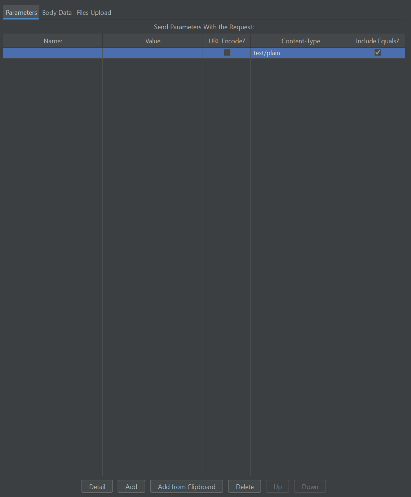

Pour finir, et pour avoir les résultats des multiples tests, vous pouvez rajouter des analyses à votre test, en allant encore une fois dans "Edit", "Add", "Listner", et finalement choisissez les analyses que vous voulez ajouter.


Dans mon cas, voilà toutes les analyses que j'ai ajoutées dans mon test :

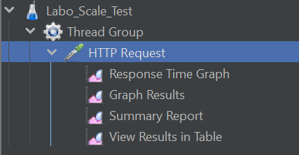

N'oubliez pas de sauvegarder votre fichier de tests pour que vous ne perdiez aucunes configurations !

### 4) Tests des capacités du site web

Pour lancer un test de capacité sur notre site web sur JMeter, après avoir effectuée les différentes configurations, vous pourrez vous rendre dans le menu en haut à gauche, et cliquez sur le triangle vert. Normalement, si vous survolez le triangle, il y aura écrit "Start".

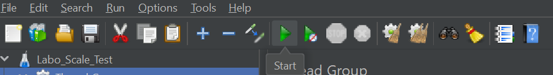

Voici les paramètres que j'ai tester sur mon site :
1. Petit test
	1. "Number of Threads" = 10
	2. "Ramp up" = 1
	3. et "Loop Count" = 5
2. Test de charge moyenne
	1. "Number of Threads" = 50
	2. "Ramp up" = 1
	3. et "Loop count" 10
3. Gros test de charge (pour ce test, vous pouvez l'arrêter après une minute)
	1. "Number of Threads" = 500
	2. "Ramp up" = 3
	3. et "Loop count" = 5

Voici les différents résultat que j'ai obtenu :

|                       | 1   | 2    | 3    |
| --------------------- | --- | ---- | ---- |
| Requêtes envoyées ?   | 50  | 550  | 2884 |
| Combien de réponses ? | 50  | 550  | 2884 |
| Latence ?             | 54  | 1443 | 8897 |

Concernant les résultats, on peut apercevoir que la latence est comme "exponentielle" lorsque que le nombre de requêtes augment, ce qui est normal, car à mesure que la charge augmente, notre serveur web se rapproche de ses limites (en termes de performance), et la latence commence à augmenter. Elle augment de manière "exponentielle" parce que vous envoyez des requêtes, plus votre serveur web est surchargé, ce qui ralentit le traitement des requêtes et la transmission des données.

### 5) Autres tests des capacités du site web

Voici les autres tests que j'ai pu effectuée :
1. Test 1
	1. "Number of Threads" = 30
	2. "Ramp Up" = 5
	3. et "Loop Count" = 10
2. Test 2
	1. "Number of Threads" = 50
	2. "Ramp Up" = 10
	3. et "Loop Count" = 5
3. Test 3
	1. "Number of Threads" = 250
	2. "Ramp Up" = 1
	3. et "Loop Count" = 10
4. Test 4
	1. "Number of Threads" = 10
	2. "Ramp Up" = 2
	3. et "Loop Count" = 20
5. Test 5
	1. "Number of Threads" = 50
	2. "Ramp Up" = 25
	3. et "Loop Count" = 10

Et les résultat que j'ai obtenu :

|                     | 1   | 2   | 3    | 4   | 5   |
| ------------------- | --- | --- | ---- | --- | --- |
| Requêtes envoyées ? | 350 | 600 | 3100 | 200 | 500 |
| Combien de réponses | 350 | 600 | 3100 | 200 | 500 |
| Latence ?           | 165 | 117 | 5866 | 98  | 38  |

Comme pour les premiers tests que vous aurez effectués, plus il y a de paquets HTTP transmis sur le serveur web, plus la latence est élevé.
