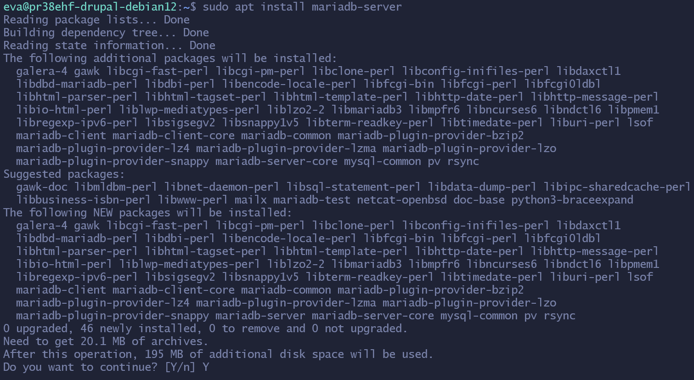
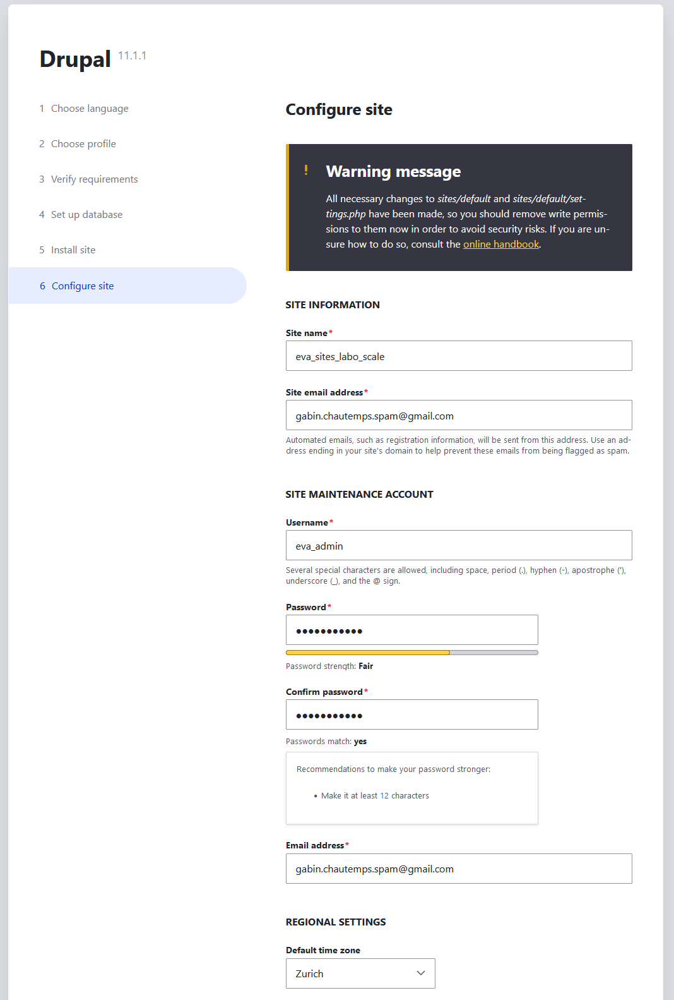
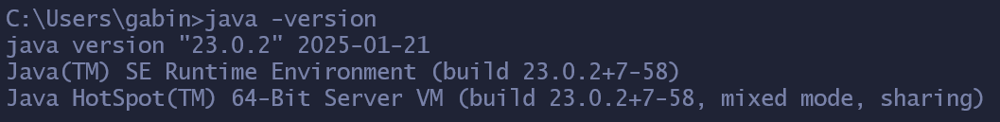

Dans ce projet, nous allons installer le CMS (Content Management System) Drupal, pour créer et gérer un site web, pour ensuite tester sa capacité à monter en charge, avec l'application JMeter.
## Objectifs
- Installer un CMS (dans notre cas Drupal), sur une machine virtuelle dans le cloud d'Azure.
- Installer JMeter, en local, pour tester et mesurer la scalabilité du site web.
## Qu'est la scalabilité ?
La scalabilité est la capitée d'un système (dans notre cas, un site web) à s'adapter à une demande qui augment ou qui diminue sans perdre de ces performances. Donc un système scalable, quand la demande augmente, va pouvoir gérer cette augmentation sans planter, et quand la demande diminue, il va aussi pouvoir s'adapter à cette diminution sans perdre en performances. Aujourd'hui, presque tous les sites web, et les applications, sont des système scalable (par exemple : Amazon, AliExpress, Facebook, Instagram, Netflix, Google, etc... ont tous une infrastructure qui permet de s'adapter pour éviter les pannes et garantir une bonne expérience pour les utilisateurs).
## Préface
Pour que le projet fonctionne, nous allons installer plusieurs programmes. Voici ce qu'on va installer sur notre machine virtuelle :
- [Apache2](https://httpd.apache.org/) (serveur web)
- [PHP 8.3](https://www.php.net/) (langage de script pour les pages web)
- [MariaDB](https://mariadb.org/) (SGBD pour créer la BD pour Drupal)
- [Composer](https://getcomposer.org/) (gestionnaire de dépendances pour PHP)
- Et [Drupal](https://new.drupal.org/home) (CMS que nous allons utiliser pour ce projet)

Et voici ce qu'on va installer sur notre machine en local :
- [Java 23](https://www.oracle.com/ch-fr/java/technologies/downloads/) (langage de programmation pour faire fonctionner JMeter)
- [JMeter](https://jmeter.apache.org/) (pour mesurer la scalabilité de notre site web)
## Première étape, installation du CMS
Avant de pouvoir commencer les installations des multiples programmes, nous devons d'abord mettre à jour les paquets présents sur notre machine virtuelle, avec ces deux commandes :

```
sudo apt update
```

```
sudo apt upgrade
```

Le "sudo" est nécessaire, car les commandes ci-dessus, qu'on veut exécuter, ne peuvent pas être exécuté par un utilisateur normal. 
### 1) Installation d'Apache2
Apache HTTP Server est un logiciel libre créé et maintenu par la fondation du même nom et est distribué selon les normes de la licence Apache. C'est l'un des serveurs HTTP les plus populaires. Nous allons l'installer et le configurer pour ce projet.
Pour installer le serveur web d'Apache, vous pouvez lancer la commande suivante dans votre terminal :

```
sudo apt install apache2
```


Il suffira juste d'entrer "Y" quand votre machine aura trouvé les paquets. Une fois tous les paquets téléchargés, vous pouvez activer et lancer le service avec cette commande :

```
sudo systemctl enable apache2 && sudo systemctl start apache2
```


Ici, j'ai ajouté dans la commande les caractères "&&", cela permet d'exécuter deux commandes en une seule fois.
Pour vérifier si le service est en train de tourner, vous pouvez exécuter la commande suivante, toujours dans votre terminal :

```
sudo systemctl status apache2
```

Vous devrez normalement apercevoir le résultat suivant :


Pour quitter la "vérification", vous pouvez juste appuyer sur la touche "Q".
### 2) Installation de PHP 8.3
Après avoir installé Apache2, nous allons désormais installer la version 8.3 de PHP.
PHP : Hypertext Preprocessor, plus connu sous le sigle PHP, est un langage de script libre, principalement pour produire des pages web dynamique sur un serveur web.
Avant de pouvoir l'installer, nous allons d'abord installer quelques dépendances, d'abord "apt-transport-https" avec cette commande :

```
sudo apt install apt-transport-https
```


Ensuite, on va ajouter un dépôt qui va nous permet d'avoir les modules PHP à jour, ainsi que la clé pour y accéder.
D'abord l'accès au dépôt :

```
sudo curl -sSLo /usr/share/keyrings/deb.sury.org-php.gpp https://packages.sury.org/php/apt.gpg
```


Puis la clé :

```
sudo sh -c 'echo "deb [signed-by=/usr/share/keyrings/deb.sury.org-php.gpg] https://packages.sury.org/php/ $(lsb_release -sc) main" > /etc/apt/sources.list.d/php.list'
```


Par la suite, on peut relancer la commande "sudo apt update" pour avoir les derniers paquets, du dépôt, à jour.


Après avoir mis à jour les derniers paquets, nous allons à présent ajouter quelques modules de PHP qui vont être utiles pour la suite du projet, en utilisant cette commande :

```
sudo apt install php8.3-{cli,common,imap,redis,snmp,xml,mysql,zip,mbstring,curl,gd}
```


Comme dit précédemment, pour que l'installation se lance, il suffira d'entrer la lettre "Y".
On peut d'ailleurs voir qu'on installe des modules comme : cli, imap, xml, mysql, etc...

J'ai aussi rajouté un dernier module pour le bon fonctionnement entre PHP et notre serveur web Apache, avec cette ligne de commande :

```
sudo apt install php8.3 libapache2-mod-php8.3
```


Pour vérifier si PHP s'est bien installé, on peut utiliser la commande ci-dessous :

```
php -v
```


Et pour vérifier si ces modules se sont bien installé, cette fois-ci, on utilise cette commande :

```
php -m
```


### 3) Installation de Maria DB

MariaDB est un système de gestion de bases de données (ou sous le sigle SGBD) édité sous la licence GPL. Il s'agit d'un "fork" communautaire de MySQL, un autre SGBD. Nous allons l'utiliser pour créer une base de données pour Drupal.
D'abord, lancez la commande suivante pour l'installer :

```
sudo apt install mariadb-server
```



Puis, pour activer et lancer ce SGBD, utilisez la commande suivante :

```
sudo systemctl start mariadb && sudo systemctl enable mariadb
```


Enfin, pour vérifier l'état de MariaDB, vous pouvez utiliser la commande ci-dessous :

```
sudo systemctl status mariadb
```


### 3.1) Configurations d'une DB Drupal

Avant d'installer les deux derniers programmes (Composer, et Drupal), nous allons configurer une base de données, pour Drupal, en utilisant MariaDB.

Pour se connecter au SGBD, vous pouvez utiliser la commande suivante :

```
sudo mysql -u root
```


Pour commencer, nous allons créer un utilisateur ayant les droits nécessaires pour accéder et manipuler les données des tables de la base de données. Cette étape est indispensable, car ses informations seront requises lors de la configuration de Drupal.

Pour créer un utilisateur, voici la commande qu'il faudra exécuter dans votre SGBD : 

```
CREATE USER 'drupal'@'localhost' IDENTIFIED BY 'votre_pwd_ici';
```


Le nom ici n'a pas vraiment d'importance. Ce qui faut faire vraiment attention, par contre, c'est de ne pas oublier le "localhost" après le nom de l'utilisateur. 

"IDENTIFIED" permet de configurer un mot de passe pour l'utilisateur. Ceci n'est pas nécessaire sauf si vous voulez rajouter une couche de protection et de sécurité sur vos bases de données. 

Ensuite, créez la base de données avec cette commande :

```
CREATE DATABASE drupal; 
```


Encore une fois, le nom que vous choisissez, pour votre base de données, n'a pas vraiment d'importance, vous pouvez l'appeler comme vous le souhaitez. J'ai choisi "drupal" pour que cela soit en lien avec le projet en question.

Après cela, nous allons ajouter les droits de l'utilisateur, qu'on a créé précédemment, sur la base de données : 

```
GRANT ALL PRIVILEGES ON drupal.* TO 'drupal'@'localhost';
```


Pour plus de simplicité, je lui ai mis tous les droits sur toutes les tables de la base de données "drupal".

Finalement, pour que les droits soient bien appliqués dans votre SGBD, utilisez la commande ci-dessous : 

```
FLUSH PRIVILEGES
```

Puis comme nous n'allons plus utiliser le SGBD, pour l'instant, vous pouvez vous déconnecter :

```
EXIT;
```


### 4) Installation de Composer

Il y a différentes manières d'installer, et de configurer Drupal. Pour cette documentation, je vais utiliser le logiciel : Composer.

Composer et un gestionnaire de dépendance libre conçu dans le langage de programmation PHP. Il nous permet d'installer des bibliothèques que le projet a besoin.

Pour pouvoir installer Composer, nous allons d'abord télécharger l'installeur, en utilisant cette commande : 

```
wget -O composer-setup.php https://getcomposer.org/installer
```


Puis, vous pouvez le lancer, après que l'installation soit finie :

```
sudo php composer-setup.php  --install-dir=/usr/local/bin --filename=composer
```


On peut utiliser la commande ci-dessous pour vérifier si l'application s'est bien installée :

```
composer -v
```


### 5) Installation de Drupal

Finalement, nous allons pouvoir installer Drupal !

Drupal est un système de gestion de contenu (ou sous le sigle CMS) qui est libre et open-source publié sous la licence générale GNU. Comme Composer, c'est un programme écrit en PHP. Nous allons l'utiliser, dans ce projet, pour créer notre site web.

Tout d'abord, installez le template de Drupal, avec la commande ci-dessous :

```
sudo composer create-project drupal/recommended-project my-drupal-project
```

Cela téléchargera tous les fichiers que nous aurons besoin, ainsi cela évitera de faire des manipulations en plus. 

Ensuite, il faudra créer un fichier de configuration, sur le serveur web d'Apache, pour pouvoir accéder à Drupal dans un navigateur web. Les prochaines étapes pour l'installation et la configuration du CMS seront indiquées dans le navigateur.

Tout d'abord, pour créer ce fichier de configuration, il faut se rendre dans le dossier des site disponible du serveur, en utilisant cette commande :

```
cd /etc/apache2/sites-available/
```

Ensuite, pour créer ce fichier, vous pouvez exécuter la commande suivante :

```
sudo touch drupal.conf
```

Ici, il faut utiliser le "sudo ", car vous n'aurez pas les droits de modifications dans le dossier "/etc/apache2/sites-available". Le nom n'a pas d'importance.


Pour modifier ce fichier, je vais utiliser l'éditeur de texte "Nano" :

```
sudo nano drupal.conf
```

Comme dit précédemment, vous n'avez pas les droits de modifications dans le fichier, c'est pour cela qu'on doit ajouter le "sudo" au début de la commande.

Tout d'abord, écrivez la ligne suivante, dans votre fichier :

```
<VirtualHost *:80>
ServerName localhost
```

Cette ligne, est une balise qui va dire au serveur d'Apache que toutes les connexions sur le port 80 (HTTP) vont être redirigé sur lui-même. Si vous avez un nom de domaine à disposition, vous pouvez replacer le localhost par ce nom. Dans mon cas, je n'ai pas de domaine, donc je vais laisser localhost.

Ensuite, vous devrez préciser, dans votre fichier de configurations, le chemin d'accès des ressources de Drupal, pour que votre serveur Apache sait qu'est ce qu'il faudra afficher lorsqu'on arrive sur le site. Dans mon cas, la ligne de commande est la suivante :

```
DocumentRoot /home/eva/my-drupal-project/web
```

La prochaine étape consiste à définir les paramètres de chemin d'accès des ressources :

```
<Directory /home/eva/my-drupal-project/web>
AllowOverride All
Require all granted
</Directory>
```

Les dernières lignes qui vont être écrites dans le fichier concernent les "log". Elles ne sont pas obligatoires, mais pour avoir plus de facilité pour le débogage, je vais quand même les ajouter dans mon fichier de configuration :

```
ErrorLog ${APACHE_LOG_DIR}/error.log
CustomLog ${APACHE_LOG_DIR}/access.log combined
```

Et pour finir, nous allons fermer la balise du début, avec cette commande :

```
</VirtualHost>
```

Donc, finalement, votre fichier de configurations devrait ressembler comme le mien :

```
<VirtualHost *:80>
	ServerName localhost

	DocumentRoot /home/eva/my-drupal-project/web

	<Directory /home/eva/my-drupal-project/web>
		AllowOverride All
		Require all granted
	</Directory>

	ErrorLog ${APACHE_LOG_DIR}/error.log
	CustomLog ${APACHE_LOG_DIR}/access.log
</VirtualHost>
```

Effectuez la combinaison de touches "CTRL+S", pour sauvegarder le fichier, et "CTRL+X" pour quitter Nano, si vous avez effectué les modifications avec cet utilitaire.

Ensuite, il faudra remplacer le fichier de configuration de base d'Apache2 avec le fichier qu'on vient de créer, d'abord en le désactivant avec cette commande :

```
a2dissite 000-default.conf
```

Puis, activez le fichier de configuration en utilisant la commande ci-dessous :

```
sudo a2ensite drupal.conf
```

Finalement, redémarrer le système Apache2 :

```
systemctl restart apache2
```

### 5.1) Installation de Drupal, suite

Une fois le fichier configuré, vous pouvez ouvrir votre navigateur de préférence, et entrez l'adresse IP publique de votre machine virtuelle, ainsi que le port HTTP (donc le port 80) de cette manière :

```
ip_publique_machine:80
```

Vous devrez normalement arriver dans la première section de Drupal qui s'appelle "Choose Language".

Si vous arrivez sur la page de base d'Apache2 (exemple ci-dessous), essayez de relancer les dernières commandes du point cinq.


Dans la première section, vous pouvez choisir la langue de Drupal. Pour des raisons de simplicité, j'ai décidé de mettre la langue en anglais. Ensuite, cliquez sur "Save and continue".


Puis, dans la deuxième section "Choose profile", vous pouvez choisir entre trois installations différentes :

- Standard :
	- Installation standard de Drupal, avec des configurations pré configurés. C'est celle-ci que nous allons utiliser pour créer notre site.
- Minimal :
	- Installation sans configurations pré configurés. Pour les utilisateurs avancés.
- Demo: Umami Food Magazine (Experimental) :
	- Installation d'un exemple de site pour montrer les capacités de Drupal.

Choisissiez la configuration standard et cliquez, encore une fois, sur "Save and continue".


Il est possible que l'installation vous retourne des erreurs concernant des fichiers introuvables, ou des problèmes d'accès. Mais ne vous inquiétez pas, j'ai aussi eu certains de ces problèmes lors de mon installation. Donc, voici les commandes qui faudra exécuter, dans votre terminal, pour résoudre ces problèmes ! 

Création du dossier "sites/default/files" :

```
sudo mkdir sites/default/files
```

Modification des droits d'accès sur celui-ci :

```
sudo chmod a+w sites/default/files
```

Renommage du fichier "default.settings.php" en "setting.php" dans le dossier "sites/default" :

```
cp sites/default/default.settings.php sites/default/settings.php
```

Modification des droits d'accès sur le fichier :

```
chmod a+w sites/default/settings.php
```

Après avoir effectué ces commandes, relancer la page de l'installation de Drupal, et normalement, vous devrez arriver dans la section "Set up database".

Ici, entrez les informations, que vous avez saisies au chapitre quatre de cette documentation, pour la configuration de la base de données de Drupal. Puis, cliquez sur "Save and continue".


Finalement, Drupal s'installera. Cela peut prendre quelques minutes. 


Il suffira, dans la dernière section "Configure site", que vous entrez quelques informations comme le nom de votre site, le compte de maintenance, etc...



Normalement, votre site se rafraîchira, et vous accéderez à la page de bienvenue.


### 6) Création d'un article

Avant de passer au test de performance, nous allons créer un article sur notre site. 
Pour commencer, cliquer sur le bouton "Content" en haut à gauche de votre site, normalement en dessous de "Manage". 
Une nouvelle page s'ouvrira, où vous pourrez cliquer ensuite sur le bouton "+ Add content".


Puis, cliquez sur "Article".


Ensuite, une nouvelle page s'affichera. C'est ici où nous allons pouvoir éditer notre article. Il y a plusieurs éléments à prendre en compte :
- "Title", le titre de l'article.
- "Image", une image qui commencera l'article. Cela n'a pas d'importance.
- "Alternative text", dans la section "Image", une petite description qui s'affichera lorsque l'image n'arrive pas à se charger.
- "Body", le contenu de l'article. Cela peut être du texte, des tableaux, des images, etc...
- "Tags", balises permettant de séparer des articles entre eux. Encore une fois, cela a très peu d'importance.
- Et finalement "URL alias", le chemin de l'article qui est à précisé. Attention, vous n'avez pas besoin de préciser l'adresse de votre site, juste le sous-chapitre où vous aimerez que l'article y soit.

Une fois vos modifications terminées, vous pourrez simplement cliquer sur le bouton "Save", qui se trouve normalement en bas à gauche de votre page.


L'article s'ouvrira, où vous pourrez voir si vos modifications ont été faites.


## Deuxième étape, installation JMeter

JMeter est un logiciel libre, écrit en Java, permettant d'effectuer des tests de performance d'applications ou de serveurs selon les protocoles. Il est développé par la Fondation Apache. 

Nous allons l'utiliser pour mesurer le temps de réponse de chaque requête HTTP sur notre site web.

### 1) Installation de Java 23

Java est un langage de programmation de haut niveau orienté objet. Nous allons installer la version 23 (dernière version officiellement disponible depuis le 17 septembre 2024) pour pouvoir utiliser JMeter.

Tout d'abord, rendez-vous sur le site d'Oracle pour pouvoir télécharger Java 23. Autrement, vous pouvez suivre le lien [ici](https://www.oracle.com/ch-de/java/technologies/downloads/#jdk23-windows).

Choisissiez l'OS installé sur votre machine locale. Dans mon cas, ma machine est sous Windows 11, donc je vais dans la section Windows. Cela vous montrera différentes manières d'installer la version 23 de Java, personnellement, je vais utiliser l'installation en MSI (Microsoft System Installer) pour cette documentation.


Une fois télécharger, ouvrez le fichier.

Cliquez ensuite sur "Next >", quand la fenêtre s'ouvrira.


Ici, vous pouvez changer le dossier de destination de Java 23 (pour ma part, je vais le laisser par défaut). Cliquez ensuite sur "Next".

Puis, le téléchargement commencera. Cela peut prendre quelques minutes.


Une fois le téléchargement fini, vous pouvez cliquer le bouton "Close".


Normalement, si l'installation de Java 23 s'est bien passé, vous pouvez ouvrir un CMD et entrez la commande suivante :

```
java -version
```



Si vous obtenez ce résultat (comme dans la capture d'écran) cela indique que le programme s'est bien installé !

### 2) Installation de JMeter

Nous allons désormais installer JMeter. Pour l'installer, vous pouvez suivre le lien suivant : [ici](https://jmeter.apache.org/download_jmeter.cgi).

Ensuite, choisissiez le dossier compressé à télécharger selon votre système d'exploitation (préférablement ".tgz" pour Linux et ".zip" pour Windows).


Et décompressez le dossier.

Recherchez, dans votre dossier décompressé, le fichier de commande Windows "jmeter.bat" (par exemple, le chemin d'accès de mon fichier "jmeter.bat" est le suivant : C:\Users\gabin\Documents\apache-jmeter-5.6.3\apache-jmeter-5.6.3\bin) et lancez le fichier, pour lancer JMeter. 


Normalement, après avoir ouvert le fichier, vous devrez arriver dans JMeter :


### 3) Configuration de JMeter

Avant de pouvoir effectuer des tests sur notre site web Drupal, nous devons configurer JMeter.

D'abord, commencer par sauvegarder votre test. Vous pourrez aussi choisir l'emplacement du fichier de test.


Ensuite, dans la section "Test Plan", pour faire les choses proprement, vous pouvez renommer votre test. Dans mon cas, je l'ai nommé comme mon fichier de test.


Puis ajouter un "Thread Group" dans votre test, en allant dans "Edit", "Add", "Threads (Users)", et finalement "Thread Group".


Un "Thread", dans JMeter, est un utilisateur virtuel qui exécute votre test en envoyant de multiples requêtes HTTP à votre serveur web, pour tester la performance de votre site web. Donc, finalement, le "Thread Group" est, mot pour mot, un groupe d'utilisateurs prêts a effectué des requêtes.

Après avoir créé le "Thread Group", celui-ci ouvrira une nouvelle fenêtre. C'est ici où nous allons pouvoir configurer les différents paramètres de notre test.


Il y a certains paramètres à prendre en compte. 

Le "Number of Threads (users)" est le nombre d'utilisateurs virtuels qui vont effectuer une requête. Plus ce nombre est grand, plus il y aura de requêtes. 

Le "Ramp Up", dans le "Thread Group", va être le temps, en seconde, que JMeter doit prendre pour démarrer le nombre total de threads. Entre autres, si notre test comprend cent "Threads" avec un "Ramp-up" de cent secondes, cela signifie que JMeter va démarrer un utilisateur virtuel toutes les secondes. Donc, au bout de cent secondes, tous les utilisateurs seront en train d'envoyer des requêtes HTTP, sur votre serveur web. 

Le "Loop count" va être le nombre d'exécutions des multiples requêtes HTTP des utilisateurs virtuels (littéralement, combien de fois le programme va effectuer X nombre de requêtes). Par exemple, si ce nombre est fixé à deux et le nombre de threads est à cent, alors il y aura deux cents requêtes sur votre site web. Si par contre, vous cocher la case "Infinite", les requêtes continueront jusqu'à ce que le test soit arrêté. 

Je vous indiquerai plus tard, dans la documentation, les valeurs des paramètres que vous pourrez inscrire dans le "Thread Group".

Ensuite, ajoutez dans le "Thread Group", un sampler d'une requête HTTP, en allant dans "Edit", "Add", "Sampler", puis "HTTP Request" pour pouvoir précisé les informations de votre site (par exemple : l'IP de celui-ci, ou encore le lien sur l'article précis).


Par exemple, voici à quoi ressemble mon sampler HTTP :


Quand vous aurez fini de préciser les paramètres du sampler HTTP, vous pourrez finalement cliquer sur le bouton "Add", qui se trouve normalement tout en bas de la page du sampler, pour pouvoir confirmer vos changements. Une nouvelle ligne, juste en dessous de "Send Parameters With the Request:" devrait s'afficher.


Pour finir, et pour avoir les résultats des multiples tests, vous pouvez rajouter des analyses à votre test, en allant encore une fois dans "Edit", "Add", "Listner", et finalement choisissez les analyses que vous voulez ajouter.


Dans mon cas, voilà toutes les analyses que j'ai ajoutées dans mon test :


N'oubliez pas de sauvegarder votre fichier de tests pour que vous ne perdiez aucunes configurations !

### 4) Tests des capacités du site web

Pour lancer un test de capacité sur notre site web sur JMeter, après avoir effectuée les différentes configurations, vous pourrez vous rendre dans le menu en haut à gauche, et cliquez sur le triangle vert. Normalement, si vous survolez le triangle, il y aura écrit "Start".


Voici les paramètres que j'ai tester sur mon site :
1. Petit test
	1. "Number of Threads" = 10
	2. "Ramp up" = 1
	3. et "Loop Count" = 5
2. Test de charge moyenne
	1. "Number of Threads" = 50
	2. "Ramp up" = 1
	3. et "Loop count" 10
3. Gros test de charge (pour ce test, vous pouvez l'arrêter après une minute)
	1. "Number of Threads" = 500
	2. "Ramp up" = 3
	3. et "Loop count" = 5

Voici les différents résultat que j'ai obtenu :

|                       | 1   | 2    | 3    |
| --------------------- | --- | ---- | ---- |
| Requêtes envoyées ?   | 50  | 550  | 2884 |
| Combien de réponses ? | 50  | 550  | 2884 |
| Latence ?             | 54  | 1443 | 8897 |

Concernant les résultats, on peut apercevoir que la latence est comme "exponentielle" lorsque que le nombre de requêtes augment, ce qui est normal, car à mesure que la charge augmente, notre serveur web se rapproche de ses limites (en termes de performance), et la latence commence à augmenter. Elle augment de manière "exponentielle" parce que vous envoyez des requêtes, plus votre serveur web est surchargé, ce qui ralentit le traitement des requêtes et la transmission des données.

### 5) Autres tests des capacités du site web

Voici les autres tests que j'ai pu effectuée :
1. Test 1
	1. "Number of Threads" = 30
	2. "Ramp Up" = 5
	3. et "Loop Count" = 10
2. Test 2
	1. "Number of Threads" = 50
	2. "Ramp Up" = 10
	3. et "Loop Count" = 5
3. Test 3
	1. "Number of Threads" = 250
	2. "Ramp Up" = 1
	3. et "Loop Count" = 10
4. Test 4
	1. "Number of Threads" = 10
	2. "Ramp Up" = 2
	3. et "Loop Count" = 20
5. Test 5
	1. "Number of Threads" = 50
	2. "Ramp Up" = 25
	3. et "Loop Count" = 10

Et les résultat que j'ai obtenu :

|                     | 1   | 2   | 3    | 4   | 5   |
| ------------------- | --- | --- | ---- | --- | --- |
| Requêtes envoyées ? | 350 | 600 | 3100 | 200 | 500 |
| Combien de réponses ? | 350 | 600 | 3100 | 200 | 500 |
| Latence ?           | 165 | 117 | 5866 | 98  | 38  |

Comme pour les premiers tests que vous aurez effectués, plus il y a de paquets HTTP transmis sur le serveur web, plus la latence est élevé.
