We're going to create, and configure, a virtual network (VN) in Azure, then we'll add two virtual machines to see if they're communicating well between each other

## Goals :
- Create a VN in Azure.
- Add two VM and test the communication.

## First step : Create and configure the virtual network
Firstly, we're going to create a virtual network, then configure its settings, by going into the research bar of Azure and researching "Virtual Network". 

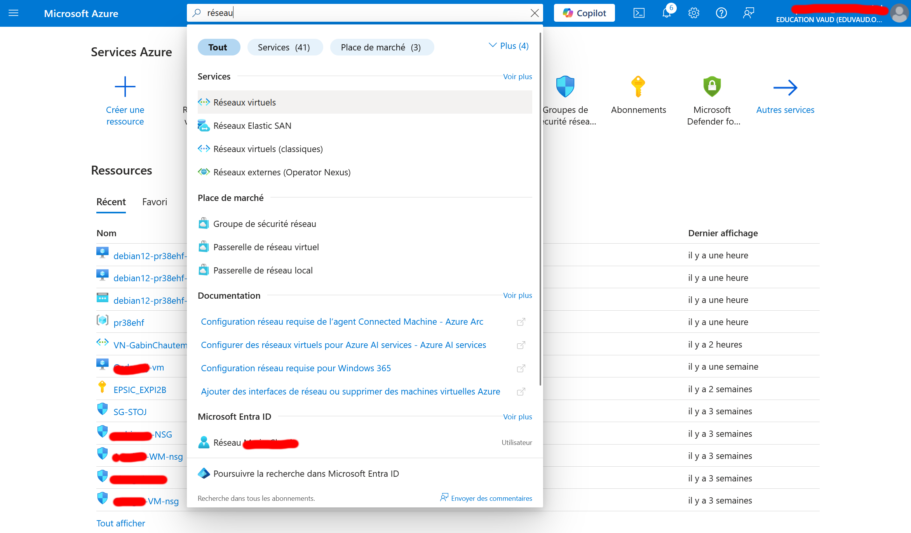

Then, click on "Create".

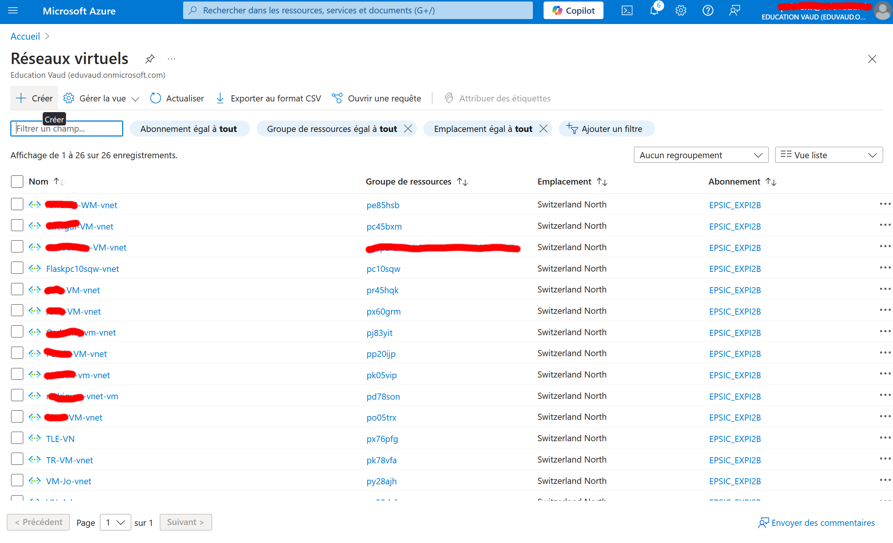

You can also see, in the page, all the virtual network created in the same Azure subscription as yours.

### Base informations
[//]: <> (Check the multiple names, they're basic translation of what was written in Azure.)
After you've pressed the button "Create", you'll arrived in the first section of the creation of a virtual network, called : "Base informations".
Here, it is important to precise, in "Project details", your subscription (which normally add itself automatically) and your ressource group, so that Azure doesn't create a new group (in my case, my ressource groupe is called : "pr38ehf").

The name of the virtual netowrk, in "Instance details", can be anything you like (in my case, I've chosen : "VN-GabinChautemps"), and like your subscription, the region will add itself automatically.

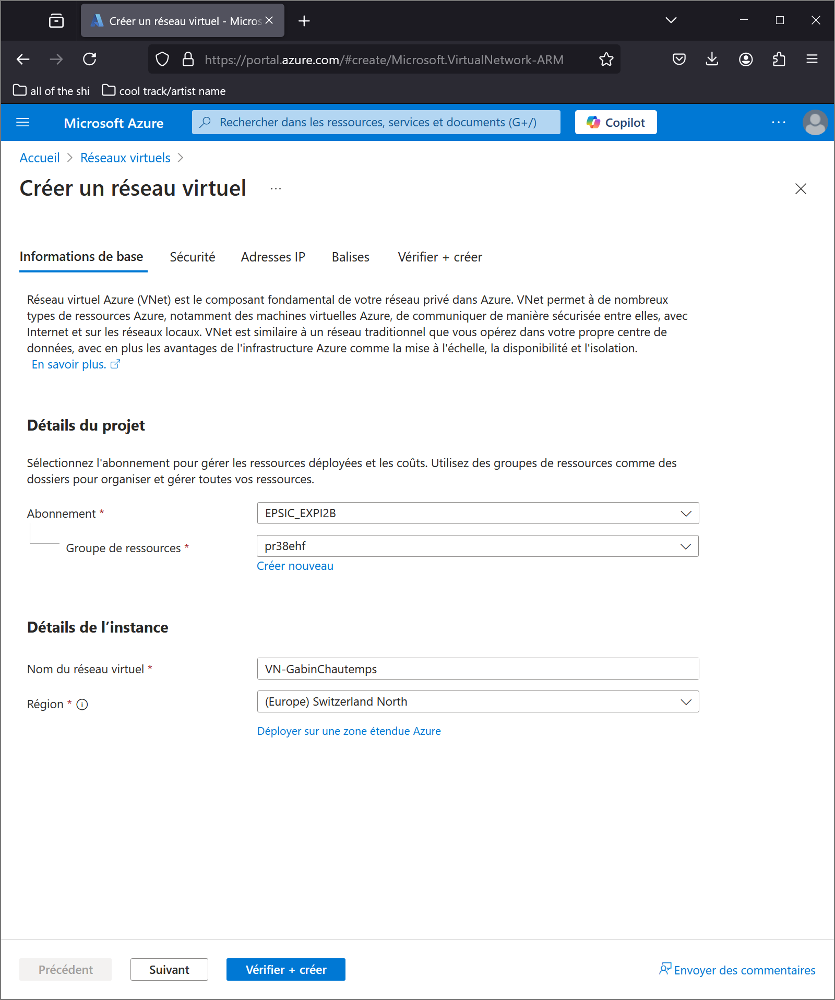

[//]: <> (Reworte the first half omg :/)
After "filling the gaps", click on "Next".

### Security
In the security section, it is possible to configure multiple security functionality, like a firewall, directly into the virtual newtowrk. However, for simplicity, we won't do it here. So click, again, on "Next".

### IP addresses
Now, we'll configure the range of the private IP addresses in our virtual netowrk.

A private IP address is an address which is used in a private network (ex. entreprise network, home network) given by the DHCP protocole (Dynamic Host Configuration Protocol). It allows devices connected to the same network to communicate with each other safely and easily. However, it's not possible to "surf" on the Internet with a private IP address.

There's three class of private IP address :
- Class A :
	- From 10.0.0.0 to 10.255.255.255
- Class B :
	- From 172.16.0.0 to 172.31.255.255
- Class C :
	- From 192.168.0.0 to 192.168.255.255

For this documentation, I'll use the class C for addressing, but the handling is the same with another class.

For starters, set your private IP address range to CIDR 23 (/23). CIDR allows you to create “super networks” with greater flexibility than other addressing methods.

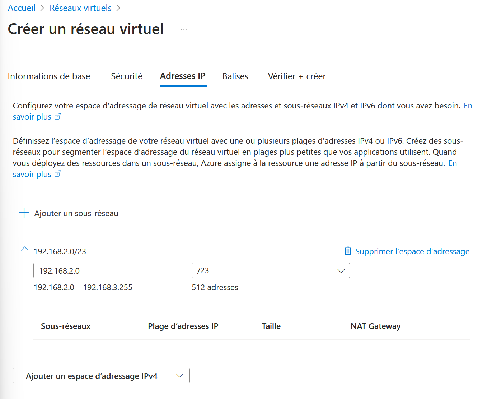

Attention, check that your virtual network range doesn't overlap with another range, otherwise there will be some errors.

Add a subnet by clicking on "Add a subnet". This will open a new page.

After that, choose the name of your subnet (in my case, it's : Chautemps-Front).

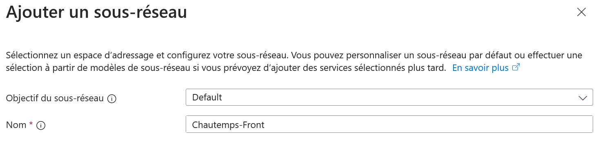

The goal of the subnet can stay to "Default".

Then, choose the range of the subnet in CIDR 24 (so /24).

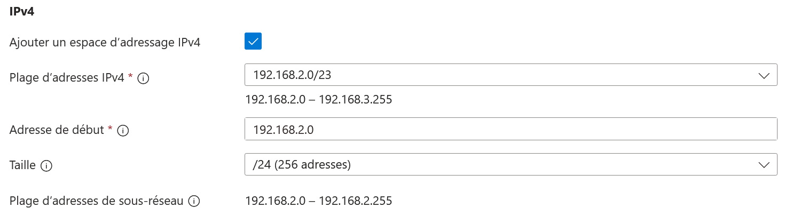

If you have a network security group (NSG), you can add it, in the security section (ex. mine's called : "SG-Gabin").

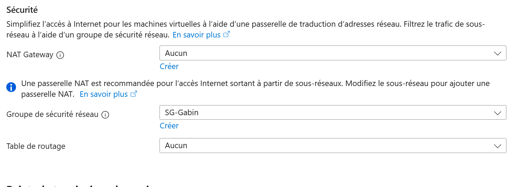

The advantage of adding your network security group on your subnet is that you can filter your virtual network traffic using the rules of your network security group (just like with a firewall). This adds another layer of security. In this way, by defining precise rules, you protect your virtual machines from external attacks and prevent unauthorized access.

After adding your network security group (or not), click on "Add" down the page. You'll be able to see, in the section where you've configure the private IP addresses, your subnet.

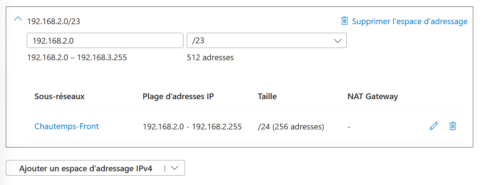

Finally, click on "Verifiy + create", then on "Create".

### Using another DNS for your virtual network
This step is totally not requiered, but I'll still explain it in this documentation.

It's possible to configure a DNS, other than using the ones from Azure directly, in the settings of your virtual network. To do this, find your virutal network in the section "Virtual network". Then search in the research box, on the left of the page, "DNS Servers", and choose "Customized".

There's multiple free DNS servers, in my case, I've chossen the ones from Cloudflare (1.1.1.1 and 1.0.0.1)

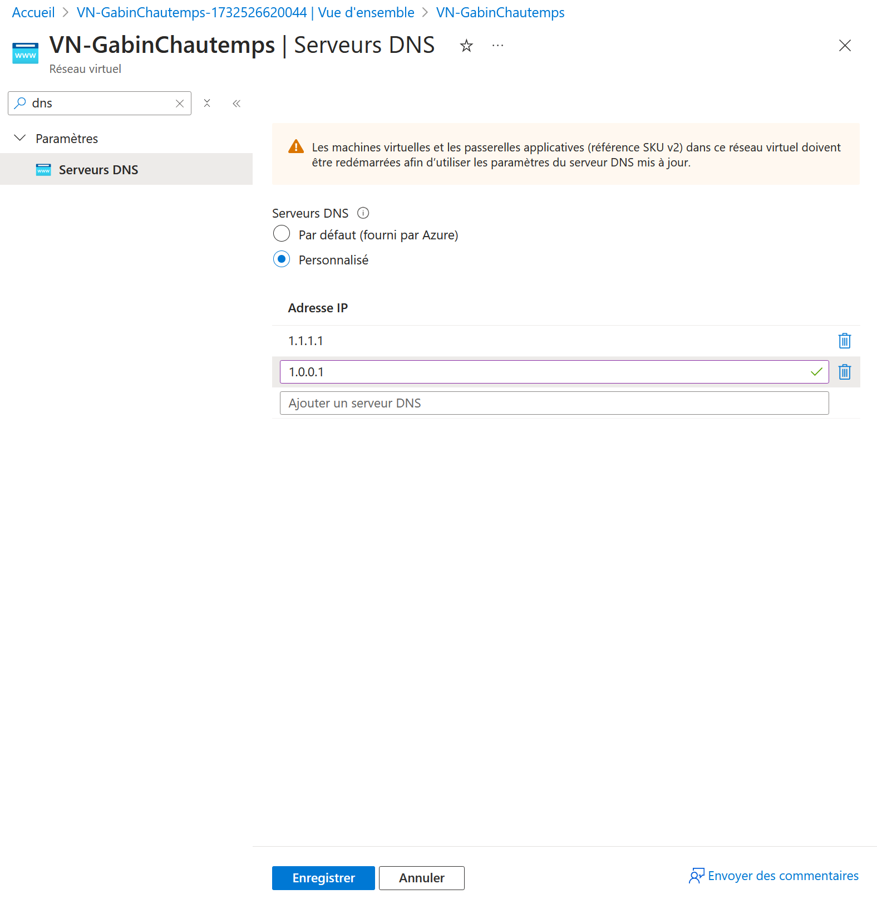

Click on "Save" to save the modifications.

## Deuxième étape : Ajout de machines virtuelles dans le réseau virtuel
Pour ajouter des machines virtuelles dans votre réseau virtuel, vous devrez passer par l'interface réseau de celle-ci :

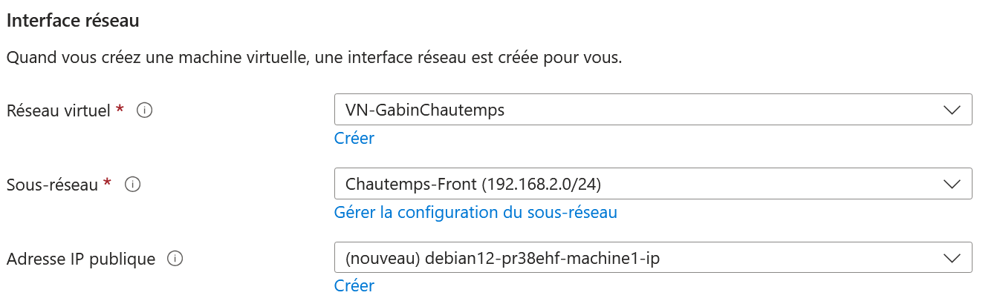

Ces options se mettront automatiquement lorsque vous créez une nouvelle machine virtuelle. Cependant, il n'est pas possible d'ajouter des machines virtuelles déjà créées dans votre réseau virtuel.

## Troisième étape : Connexion SSH aux machines virtuelles
Pour la connexion en SSH, voici comme cela va se dérouler :

.jpg)

D'abord, je lancerais deux instances Linux en utilisant WSL2 (j'utiliserais Ubuntu pour me connecter sur ma première machine, puis Kali Linux pour me connecter sur ma deuxième machine).

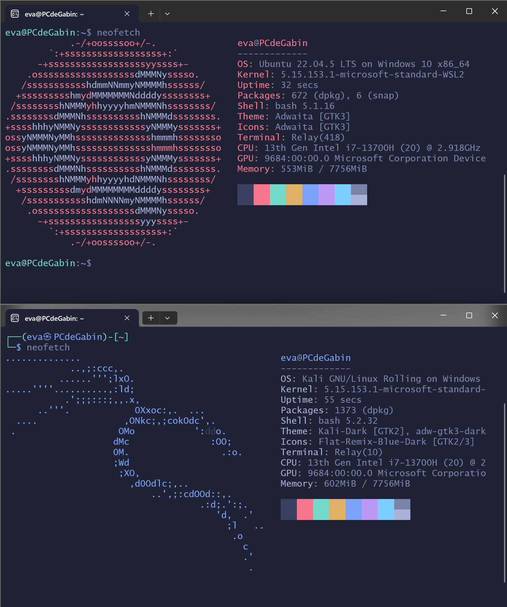

Ensuite, j'ai effectué les mêmes étapes ci-dessous deux fois pour me connecter aux machines virtuels sur Azure :
- Déplacer la clé dans le dossier "~/.ssh/".
- Changer les accès de la clé en "READ ONLY".
- Connexion sur la machine en utilisant SSH, avec l'adresse IP de la machine virtuel.

[//]: <> (A ajouter le lien vers l'autre doc)
(i) voir doc labo flask pour plus d'info

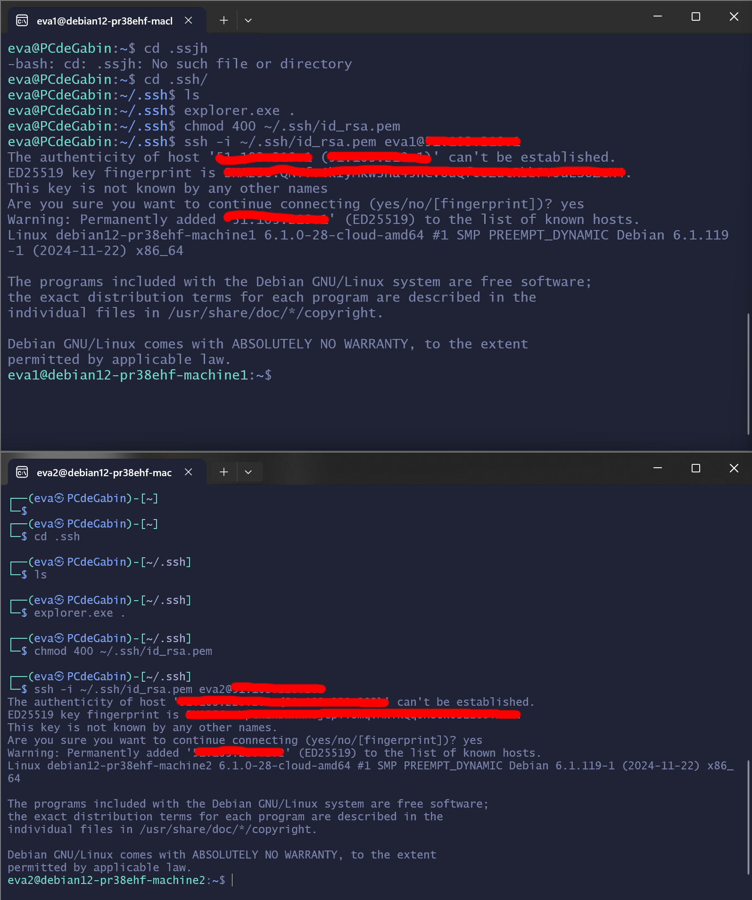
La différence entre une adresse IP publique est une adresse IP privé est que les adresse IP publique sont utilisées pour interagir avec Internet, elles ne peuvent pas être utilisé dans un réseau local privé, comparé aux adresse IP privée. Et voici les plages disponibles des adresses IP publique :
- De 1.0.0.0 à 9.255.255.255
- De 11.0.0.0 à 126.255.255.255
- De 129.0.0.0 à 169.253.255.255
- De 169.255.0.0 à 172.15.255.255
- De 172.32.0.0 à 191.0.1.255
- De 192.0.3.0 à 192.88.98.255
- De 192.88.100.0 à 192.167.255.255
- De 192.169.0.0 à 198.17.255.255
- De 198.20.0.0 à 223.255.255.255

## Quatrième étape : Test de communication
Pour vérifier si les deux machines, dans notre réseau virtuel, peuvent bien communiquer, on peut effectuer la commande "ping".

Tout d'abord, trouvez les adresses IP privé des deux machines virtuelles avec la commande suivante, dans votre terminal :

```
ip a
```

[//]: <> (Check here if I need to blurred something here, I don't want people doxing me :p)
[//]: <> (Don't think there's a lot of infos, but just to be sure.)
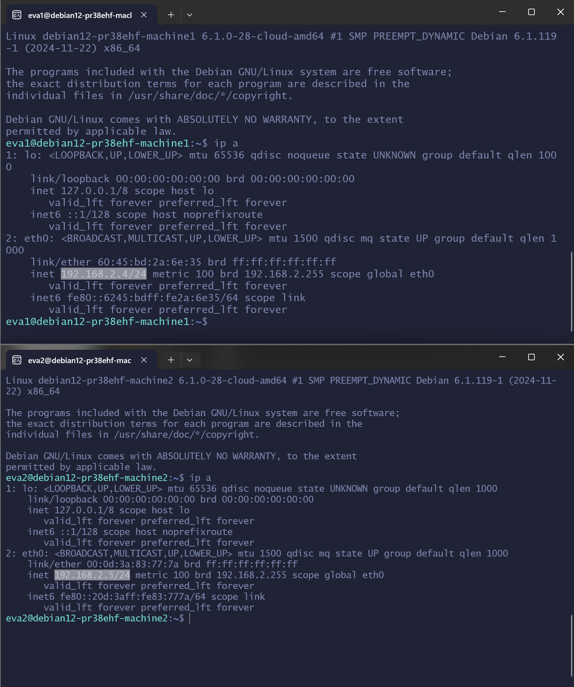

On peut voir que ma machine virtuelle n°1 (celle du haut) à l'adresse IP "192.168.2.4/24", et la machine n°2 (celle du bas) à l'adresse IP "192.168.2.5/24".

Donc, maintenant que nous avons les adresses IP des deux machines virtuelles, on va finalement pouvoir les "pinger" entre eux. C'est-à-dire, votre machine n°1 va effectuer un ping sur l'adresse IP de votre machine n°2, dans mon cas la commande est la suivante :

```
ping 192.168.2.5
```

Et votre machine n°2 va effectuer un ping sur l'adresse IP de votre machine n°1, voici encore une fois la commande, dans mon cas :

```
ping 192.168.2.4
```

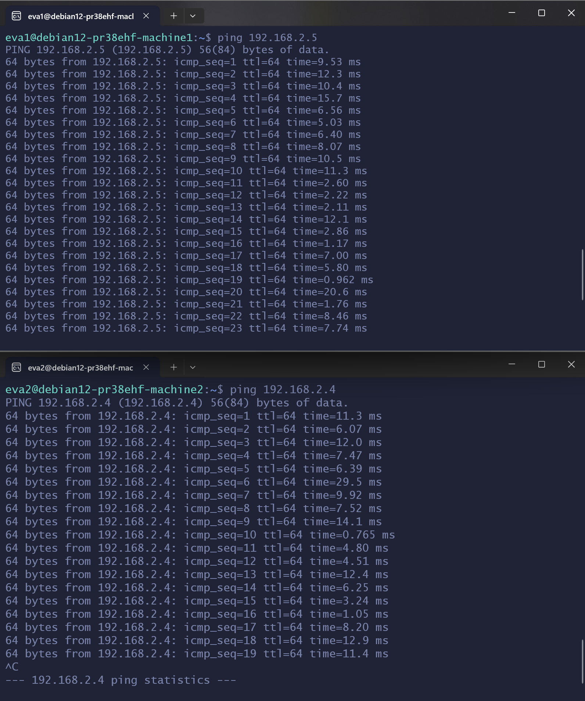

Vous devrez normalement voir chaques paquets arrivée à leurs destinations, avec le temps que cela a pris. Si c'est le cas, c'est que les machines peuvent bien communiquer entre elles, et donc c'est réussi !

Pour arrêter les pings, vous pouvez effectuer la combinaison de touche "CTRL+C" dans votre terminal.
