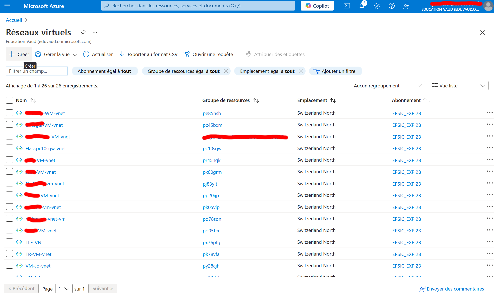
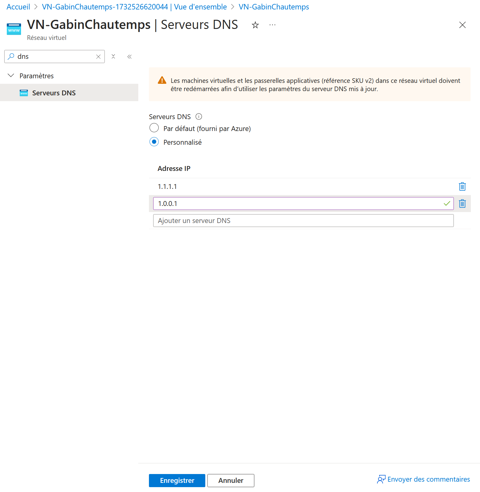
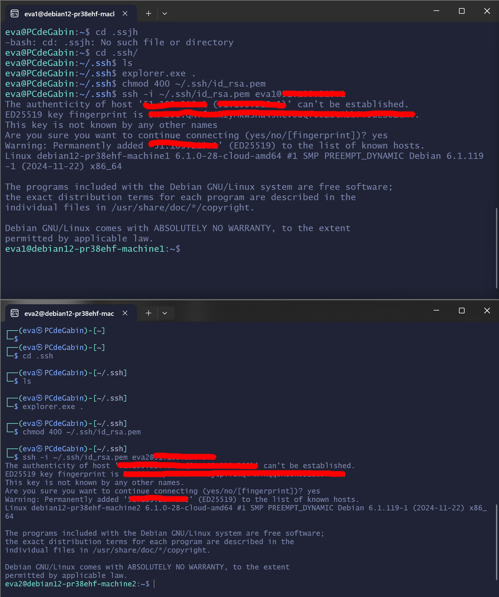

Nous allons créer, et configurer, un réseau virtuel dans le cloud Azure, puis nous ajouterons deux machines pour voir si elle communique bien entre elles.

## Objectif :
- Création d'un réseau virtuel dans le cloud Azure.
- Ajout de deux machines et test de communication entre elles.

## Première étape : Création et configuration d'un réseau virtuel (virtual network)
Tout d'abord, nous allons créer un réseau virtuel, et configurer ces paramètres, en recherchant dans la barre de recherche de Microsoft Azure "Réseaux virtuels". 


Puis, cliquez sur "Créer".



Vous pouvez aussi voir, dans sur cette page, tous les réseaux virtuels qui ont été créer dans le même abonnement que vous.

### Informations de base
Après avoir cliqué sur le bouton "Créer", vous arriverez sur la première section de la création d'un réseau virtuel : "Informations de base".
Ici, il est important de bien préciser, dans "Détails du projet", votre abonnement (qui normalement se met automatiquement) ainsi que votre groupe de ressource, afin qu'Azure vous créer un nouveau groupe pour cette ressource (dans mon cas, mon groupe de ressource est : "pr38ehf").

Le nom du réseau virtuel, dans "Détails de l'instance", n'a pas d'importance (dans mon cas, le nom que j'ai choisi est : VN-GabinChautemps), et la région devrait se mettre automatiquement, comme pour votre abonnement.


Après avoir rempli les champs, cliquez sur "Suivant".

### Sécurité
Dans la section sécurité, il est possible de configurer diverses fonctionnalités de sécurité, comme un firewall, directement sur le réseau virtuel. Cependant, pour simplifier, nous ne le ferons pas. Donc cliquez, encore une fois, sur "Suivant".

### Adresses IP
Maintenant, nous allons configurer la plage d'adresses IP privées de notre réseau virtuel. 

Une adresse IP privée est une adresse qui est pour usage sur un réseau interne (par exemple : réseau d'entreprise, réseau à la maison) attribué par le protocole DHCP (Dynamic Host Configuration Protocol). Elle permet aux appareils, connectés sur le même réseau, de communiquer entre eux de manière sécurisé et efficace. Cependant, il n'est pas possible de "surfer" sur Internet avec une adresse IP privée.

Il existe trois classe d'adresses IP privée :
- Classe A :
	- De 10.0.0.0 à 10.255.255.255
- Classe B :
	- De 172.16.0.0 à 172.31.255.255
- Classe C :
	- De 192.168.0.0 à 192.168.255.255

Dans cette documentation, je vais utiliser la classe C pour l'adressage, mais la manipulation devrait être la même pour les deux autres classes.

Pour commencer, définissez votre plage d'adresse IP privée en CIDR 23 (/23). Le CIDR permet de créer des "super réseaux" avec plus de flexibilité, comparé aux autres méthodes d'adressage.


Attention, vérifiez que votre réseau ne se superpose pas avec un autre réseau virtuel, sinon votre réseau ne fonctionnera pas.

Ensuite, ajoutez un sous-réseau en cliquant sur "Ajouter un sous-réseau". Cela ouvrira une nouvelle page.

Puis, choisissiez le nom de votre sous-réseau (dans mon cas, j'ai choisi : Chautemps-Front). 


L'objectif du sous-réseau peut rester en "Default".

Après cela, définissez la plage du sous-réseau en CIDR 24 (donc /24).


Si vous avez un groupe de sécurité réseau (NSG), ajoutez-le, dans la section sécurité (personnellement, mon groupe de sécurité s'appelle : "SG-Gabin"). 


L'avantage de définir votre groupe de sécurité réseau sur votre sous-réseau est de pouvoir filtrer le trafic, de votre réseau virtuel, avec les règles de votre groupe de sécurité réseau. Comme avec un pare-feu (firewall). Donc, cela rajoute une couche de sécurité en plus. De cette manière, en définissant des règles précises, vous protégez vos machines virtuelles des attaques extérieures et vous empêchez les accès non autorisés.

Après avoir ajouté votre groupe de sécurité réseau (ou pas), cliquez sur le bouton "Ajouter" tout en bas de la page. Vous pourrez ensuite voir dans la section où vous avez configuré la plage d'adresse IP privée, votre sous-réseau.


Pour finir, cliquez sur "Vérifier + créer", puis sur "Créer".

### Définir d'autres DNS dans le réseau virtuel
Cette étape est totalement optionnel, mais je vais quand même l'expliquer dans cette documentation.

Il est possible de configurer un DNS, au lieu d'utiliser ceux directement fournit par Azure, dans les paramètres de votre réseau virtuel. Pour effectuer cela, recherchez, dans la barre de recherche "Réseau virtuels", puis dans la liste ci-dessous, recherchez votre réseau virtuel. Ensuite dans la barre de rechercher, qui se situe à gauche de la page, recherchez "Serveurs DNS", et choisissiez "Personnalisé".

Il existe plusieurs serveurs DNS gratuits, dans mon cas, j'ai choisi les IP des serveurs de Cloudflare (1.1.1.1 et 1.0.0.1).



Cliquez sur "Enregistrer" pour sauvegarder vos modifications.

## Deuxième étape : Ajout de machines virtuelles dans le réseau virtuel
Pour ajouter des machines virtuelles dans votre réseau virtuel, vous devrez passer par l'interface réseau de celle-ci :


Ces options se mettront automatiquement lorsque vous créez une nouvelle machine virtuelle. Cependant, il n'est pas possible d'ajouter des machines virtuelles déjà créées dans votre réseau virtuel.

[//]: <> (C'est nul ^.)
[//]: <> (Genre, il y a un technique pour y arriver sans créer de VMs.)
[//]: <> (Mais c'est très dur à mettre en place, même impossible.)

## Troisième étape : Connexion SSH aux machines virtuelles
Pour la connexion en SSH, voici comme cela va se dérouler :

.jpg)

D'abord, je lancerais deux instances Linux en utilisant WSL2 (j'utiliserais Ubuntu pour me connecter sur ma première machine, puis Kali Linux pour me connecter sur ma deuxième machine).


Ensuite, j'ai effectué les mêmes étapes ci-dessous deux fois pour me connecter aux machines virtuels sur Azure :
- Déplacer la clé dans le dossier "~/.ssh/".
- Changer les accès de la clé en "READ ONLY".
- Connexion sur la machine en utilisant SSH, avec l'adresse IP de la machine virtuel.

(i) Pour plus d'informations consernant les étapes, veuillez consulter [cette documentation](https://github.com/Evaguy/346_Documentation/tree/main/Labo_Flask).


La différence entre une adresse IP publique est une adresse IP privé est que les adresse IP publique sont utilisées pour interagir avec Internet, elles ne peuvent pas être utilisé dans un réseau local privé, comparé aux adresse IP privée. Et voici les plages disponibles des adresses IP publique :
- De 1.0.0.0 à 9.255.255.255
- De 11.0.0.0 à 126.255.255.255
- De 129.0.0.0 à 169.253.255.255
- De 169.255.0.0 à 172.15.255.255
- De 172.32.0.0 à 191.0.1.255
- De 192.0.3.0 à 192.88.98.255
- De 192.88.100.0 à 192.167.255.255
- De 192.169.0.0 à 198.17.255.255
- De 198.20.0.0 à 223.255.255.255

## Quatrième étape : Test de communication
Pour vérifier si les deux machines, dans notre réseau virtuel, peuvent bien communiquer, on peut effectuer la commande "ping".

"Ping" est le nom d'une commande pour tester la communication d'un hôte (dans notre cas, une machine virtuel à une autre) sur un réseau. Elle est présente dans tous les systèmes exploitations qui ont une capacité de mise en réseau.

Tout d'abord, trouvez les adresses IP privé des deux machines virtuelles avec la commande suivante, dans votre terminal :

```
ip a
```

La commande "ip" est une commande Linux qui permet de montrer tous les interface réseau d'une machine. Comparé à "ifconfig" (command qui vient du paquets net-tools), elle fournit des fonctionnalités supplémentaires et une syntaxe plus cohérente.

Par exemple, ici j'ai utilisé la commande "ip" avec l'option "a", pour qu'elle me montre toutes les informations des interfaces, avec les adresses IP privées des machines virtuelles (ce que j'ai surligné dans la capture d'écran ci-dessous).

[//]: <> (A voir s'il faut masquer une info ici, j'ai pas envie que les gens me dox :p)
[//]: <> (Je crois qu'il y a pas grand chose mais je veux juste être sûr.)


On peut voir que ma machine virtuelle n°1 (celle du haut) à l'adresse IP "192.168.2.4/24", et la machine n°2 (celle du bas) à l'adresse IP "192.168.2.5/24". On peut aussi voir que la plage d'addresses IP privées est la même que j'ai configurer au début.

Donc, maintenant que nous avons les adresses IP des deux machines virtuelles, on va finalement pouvoir les "pinger" entre eux. C'est-à-dire, la première machine va effectuer un ping sur l'adresse IP de la deuxième machine, dans mon cas la commande est la suivante :

```
ping 192.168.2.5
```

Et la deuxième machine va effectuer un ping sur l'adresse IP de la première machine, voici encore une fois la commande, dans mon cas :

```
ping 192.168.2.4
```


Vous devrez normalement voir chaques paquets arrivée à leurs destinations, avec le temps que cela a pris. Si c'est le cas, c'est que les machines peuvent bien communiquer entre elles !

Pour arrêter les pings, vous pouvez effectuer la combinaison de touche "CTRL+C" dans votre terminal.
